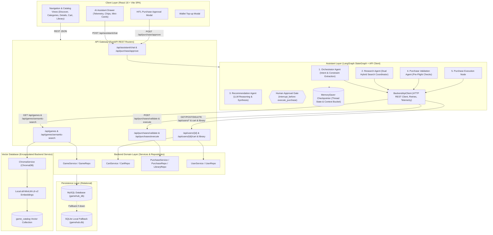
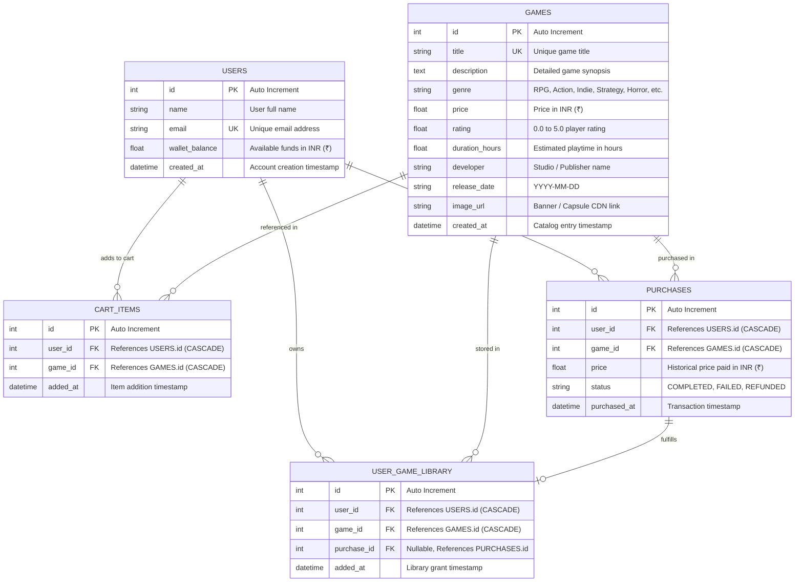
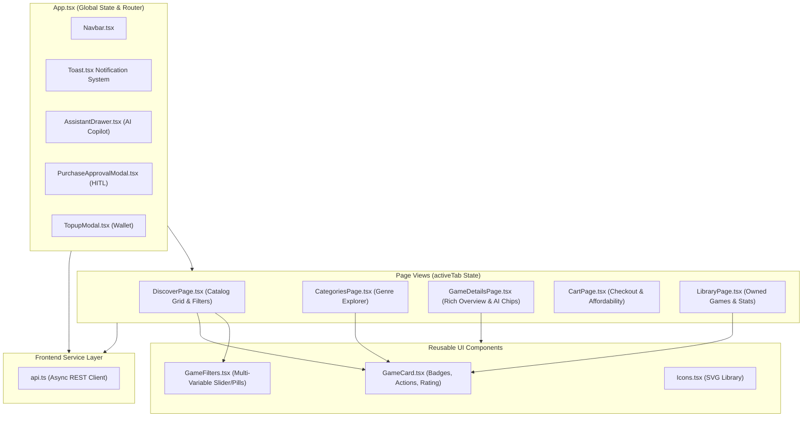
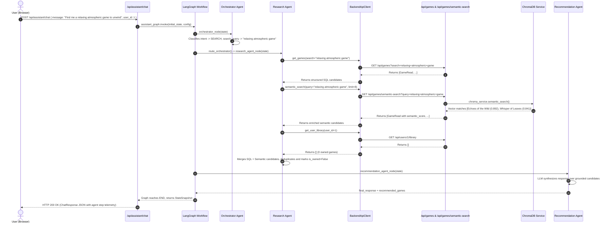
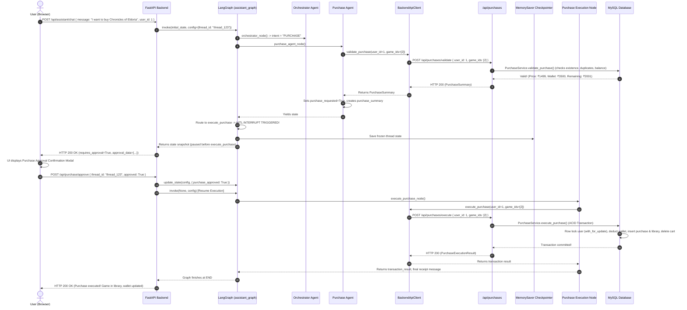

# GameHub Full-Stack Architecture & Comprehensive System Specification

> **Version:** 2.0.0  
> **Target Audience:** Developers, System Architects, AI Engineers, and Code Reviewers  
> **Codebase:** `Steam_multi_agent_actual` (Frontend + Backend)  
> **Core Technologies:** FastAPI, LangGraph, LangChain, Google Gemini / OpenAI, ChromaDB (Vector Search), SQLAlchemy (MySQL / SQLite Fallback), Pydantic v2, React 18, TypeScript, Vite  

---

## Table of Contents

1. [System Overview & Architectural Philosophy](#1-system-overview--architectural-philosophy)
2. [Complete Directory & File Taxonomy](#2-complete-directory--file-taxonomy)
3. [Database & Persistence Layer](#3-database--persistence-layer)
   - [3.1 Entity Relationship Diagram (ERD)](#31-entity-relationship-diagram-erd)
   - [3.2 Relational Data Models Specification](#32-relational-data-models-specification)
   - [3.3 Connection Pooling & Auto-Creation](#33-connection-pooling--auto-creation)
   - [3.4 Seeding & Startup Session Refresh](#34-seeding--startup-session-refresh)
4. [ChromaDB Vector Database & Semantic Search Layer](#4-chromadb-vector-database--semantic-search-layer)
   - [4.1 Embedding Generation & Vector Collection](#41-embedding-generation--vector-collection)
   - [4.2 Dual-Retrieval Hybrid Search Strategy](#42-dual-retrieval-hybrid-search-strategy)
   - [4.3 Zero-Join Metadata Payload & Similarity Scoring](#43-zero-join-metadata-payload--similarity-scoring)
5. [Layered Domain Architecture](#5-layered-domain-architecture)
   - [5.1 Repository Layer](#51-repository-layer)
   - [5.2 Service Layer](#52-service-layer)
   - [5.3 Tool Layer (Agent Grounding Bridge)](#53-tool-layer-agent-grounding-bridge)
6. [Multi-Agent System & LangGraph Orchestration](#6-multi-agent-system--langgraph-orchestration)
   - [6.1 StateGraph Topology & Execution Pipeline](#61-stategraph-topology--execution-pipeline)
   - [6.2 State Schema (`GameAssistantState`)](#62-state-schema-gameassistantstate)
   - [6.3 Checkpointing & Multi-Turn Context Memory (`context_bucket` & `MemorySaver`)](#63-checkpointing--multi-turn-context-memory-context_bucket--memorysaver)
   - [6.4 Agent 1: Lead Orchestrator Agent](#64-agent-1-lead-orchestrator-agent)
   - [6.5 Agent 2: Catalog Research Agent](#65-agent-2-catalog-research-agent)
   - [6.6 Agent 3: Recommendation & Comparison Agent](#66-agent-3-recommendation--comparison-agent)
   - [6.7 Agent 4: Purchase Pre-Validation & Resolution Agent](#67-agent-4-purchase-pre-validation--resolution-agent)
   - [6.8 Node 5: Atomic Purchase Execution Node](#68-node-5-atomic-purchase-execution-node)
7. [LLM Factory & Resilient Multi-Model Fallback Chain](#7-llm-factory--resilient-multi-model-fallback-chain)
   - [7.1 Multi-Model Fallback Chaining Architecture](#71-multi-model-fallback-chaining-architecture)
   - [7.2 Structured Outputs & Output Sanitization (`stringify_content`)](#72-structured-outputs--output-sanitization-stringify_content)
8. [Frontend Architecture & Component System](#8-frontend-architecture--component-system)
   - [8.1 Design Philosophy & Aesthetic System](#81-design-philosophy--aesthetic-system)
   - [8.2 Application State & View Routing](#82-application-state--view-routing)
   - [8.3 Component Breakdown & Hierarchy](#83-component-breakdown--hierarchy)
   - [8.4 API Client Service (`api.ts`)](#84-api-client-service-apits)
9. [End-to-End Data Flow Lifecycles (Step-by-Step Traces)](#9-end-to-end-data-flow-lifecycles-step-by-step-traces)
   - [9.1 Flow A: Natural Language & Semantic Game Search](#91-flow-a-natural-language--semantic-game-search)
   - [9.2 Flow B: Multi-Constraint Budget/Playtime Recommendation](#92-flow-b-multi-constraint-budgetplaytime-recommendation)
   - [9.3 Flow C: Game Comparison Analysis](#93-flow-c-game-comparison-analysis)
   - [9.4 Flow D: Cart Inspection & Advisory](#94-flow-d-cart-inspection--advisory)
   - [9.5 Flow E: Human-in-the-Loop (HITL) Purchase Workflow](#95-flow-e-human-in-the-loop-hitl-purchase-workflow)
   - [9.6 Flow F: Contextual Multi-Turn Referential Purchase](#96-flow-f-contextual-multi-turn-referential-purchase)
   - [9.7 Flow G: Wallet Topup & Store State Refresh](#97-flow-g-wallet-topup--store-state-refresh)
10. [API Gateway & Routing Layer](#10-api-gateway--routing-layer)
    - [10.1 REST Endpoints Contract](#101-rest-endpoints-contract)
    - [10.2 Pydantic Validation Schemas](#102-pydantic-validation-schemas)
11. [Configuration & Environment Specification](#11-configuration--environment-specification)
12. [Transactional Integrity & Error Recovery Matrix](#12-transactional-integrity--error-recovery-matrix)
13. [Testing & Verification Architecture](#13-testing--verification-architecture)

---

## 1. System Overview & Architectural Philosophy

**GameHub** is a next-generation, agentic e-commerce platform engineered for digital video game distribution. Unlike traditional static web stores where discovery is restricted to keyword searches and rigid facet checkboxes, GameHub embeds an autonomous **multi-agent artificial intelligence core** capable of multi-variable constraint solving, semantic discovery, comparative reasoning, playtime evaluation, and transactional execution with strict **Human-in-the-Loop (HITL)** safeguards.



### Core Design Principles:
1. **Zero Hallucination Guarantee:** AI agents never invent uncataloged game titles, false pricing, or imaginary system features. All recommendations and transactions are strictly grounded by invoking controlled backend REST API queries.
2. **Dual-Retrieval Hybrid Search:** Combines deterministic SQL filtering (exact price ceiling, duration, minimum rating) with ChromaDB semantic vector search (capturing natural language intent like *"games like Dark Souls with space exploration"*), fully orchestrated via backend REST endpoints.
3. **Multi-Turn Contextual Awareness:** Preserves conversation memory across interaction turns via a structured `context_bucket`, enabling referential queries such as *"buy the first one"*, *"recommend something cheaper than that"*, or *"buy the cheapest RPG under ₹2000"*.
4. **ACID Transactional Safety:** Purchases, wallet deductions, library ownership insertions, and cart removals occur inside atomic database transactions guarded by pessimistic row-locking (`with_for_update()`), invoked by agents via `POST /api/purchases/execute`.
5. **Human-in-the-Loop (HITL) Interruption:** Purchases are **never** executed autonomously. LangGraph pauses graph execution at an interrupt gate, yields control back to the human client with an itemized price summary, and only resumes upon explicit human approval.
6. **Resilient Multi-Model Fallback:** Rate limits (HTTP 429) or upstream outages automatically and invisibly fall back through a priority list of models (`gemini-3.6-flash` → `gemini-3.5-flash` → `gemini-3.7-flash` → Deterministic Rule Engine).
7. **Fresh Session Auto-Reset:** On startup or on user request, the database resets user ownership, shopping cart, and transaction logs so the demo environment starts with 0 games in the library and ₹3,500.00 in wallet funds.
8. **API-First Assistant Architecture & Complete Decoupling:** LangGraph agents and tool layer act as external clients consuming REST API endpoints via `BackendApiClient`. Direct imports of database sessions (`SessionLocal`), repositories, domain services, or vector stores (`ChromaDB`) are strictly prohibited in the agent layer, ensuring microservice readiness and clean architectural boundaries.

---

## 2. Complete Directory & File Taxonomy

```
Steam_multi_agent_actual/
├── ARCHITECTURE.md                   # Comprehensive system architectural specification (this document)
├── README.md                         # Project overview, setup guide, and features summary
│
├── backend/
│   ├── app/
│   │   ├── agents/
│   │   │   ├── __init__.py           # Package marker
│   │   │   ├── orchestrator.py       # Lead Orchestrator: Classifies intent, extracts multi-genre/price/duration constraints, handles referential hints
│   │   │   ├── purchase_agent.py     # Purchase Agent: Multi-strategy target game resolver (cart, explicit, ordinal, criteria) and pre-flight validator
│   │   │   ├── recommendation_agent.py # Recommendation Agent: Synthesizes grounded candidate games, comparison tables, and playtime-value analysis
│   │   │   └── research_agent.py     # Research Agent: Executes dual-retrieval (SQL queries + ChromaDB vector search), deduplicates candidates
│   │   │
│   │   ├── api/
│   │   │   ├── __init__.py           # Package marker
│   │   │   ├── assistant.py          # REST API: /api/assistant/chat, /api/purchase/approve, /api/purchase/reject
│   │   │   ├── cart.py               # REST API: /api/users/{user_id}/cart (GET, POST, DELETE single/all)
│   │   │   ├── games.py              # REST API: /api/games (Catalog search, filters, genres, game details)
│   │   │   ├── library.py            # REST API: /api/users/{user_id}/library (Owned games retrieval)
│   │   │   └── users.py              # REST API: /api/users/{user_id} (Profile, wallet top-up, session reset)
│   │   │
│   │   ├── database/
│   │   │   ├── __init__.py           # Package marker
│   │   │   ├── base.py               # SQLAlchemy declarative Base registry
│   │   │   ├── sample_data.py        # 18 curated AAA and Indie games dataset
│   │   │   ├── seed_data.py          # Database initializer and session refresh engine (reset_and_seed_database)
│   │   │   └── session.py            # Engine initialization, pool configuration, MySQL/SQLite failover, get_db()
│   │   │
│   │   ├── graph/
│   │   │   ├── __init__.py           # Package marker
│   │   │   ├── nodes.py              # LangGraph operational nodes (e.g. execute_purchase_node)
│   │   │   ├── state.py              # TypedDict GameAssistantState definition with context_bucket memory
│   │   │   └── workflow.py           # StateGraph compilation, conditional routing, MemorySaver checkpointer, HITL interrupts
│   │   │
│   │   ├── models/
│   │   │   ├── __init__.py           # Central export of all ORM models for SQLAlchemy discovery
│   │   │   ├── cart.py               # CartItem ORM table mapping
│   │   │   ├── game.py               # Game catalog ORM table mapping
│   │   │   ├── library.py            # UserGameLibrary ownership ORM table mapping
│   │   │   ├── purchase.py           # Purchase audit log ORM table mapping
│   │   │   └── user.py               # User account and wallet balance ORM table mapping
│   │   │
│   │   ├── prompts/
│   │   │   ├── __init__.py           # Package marker
│   │   │   ├── orchestrator_prompt.py # System prompt for LLM intent classification & constraint extraction
│   │   │   ├── purchase_prompt.py    # System prompt for purchase reasoning
│   │   │   ├── recommendation_prompt.py # System prompt for grounded recommendations & markdown comparison formatting
│   │   │   └── research_prompt.py    # System prompt for catalog retrieval
│   │   │
│   │   ├── repositories/
│   │   │   ├── __init__.py           # Repositories central export
│   │   │   ├── cart_repo.py          # Cart database queries (add, remove, clear, list with joined games)
│   │   │   ├── game_repo.py          # Game catalog queries with multi-faceted filtering and multi-column ordering
│   │   │   ├── library_repo.py       # Ownership verification and library insertion
│   │   │   ├── purchase_repo.py      # Purchase transaction history logging
│   │   │   └── user_repo.py          # User retrieval and wallet balance updates
│   │   │
│   │   ├── schemas/
│   │   │   ├── __init__.py           # Package marker
│   │   │   ├── assistant.py          # Pydantic models: ChatRequest, ChatResponse, AgentStepLog
│   │   │   ├── cart.py               # Pydantic models: CartItemRead, CartSummary, CartAddRequest
│   │   │   ├── game.py               # Pydantic models: GameRead, GameFilterParams
│   │   │   ├── purchase.py           # Pydantic models: PurchaseSummary, PurchaseExecutionResult, PurchaseApprovalRequest
│   │   │   └── user.py               # Pydantic models: UserRead, WalletTopupRequest
│   │   │
│   │   ├── services/
│   │   │   ├── __init__.py           # Package marker
│   │   │   ├── cart_service.py       # Business logic: Cart calculation, item validation, wallet affordability
│   │   │   ├── chroma_service.py     # Vector database service: ChromaDB embedding indexing, semantic similarity queries
│   │   │   ├── game_service.py       # Business logic: Faceted catalog search, genre taxonomy, sorting
│   │   │   ├── llm_factory.py        # LangChain model factory with multi-model fallback chain & stringifier
│   │   │   └── purchase_service.py   # Atomic purchase transaction with ACID locking, rollback, and validation
│   │   │
│   │   ├── tools/
│   │   │   ├── __init__.py           # Package marker
│   │   │   └── game_tools.py         # Controlled deterministic tools used by LangGraph agents (SQL + ChromaDB wrappers)
│   │   │
│   │   ├── config.py                 # Pydantic BaseSettings environment loader (.env)
│   │   └── main.py                   # FastAPI entrypoint, CORS setup, startup hooks, Chroma indexing, router mounts
│   │
│   ├── tests/
│   │   ├── test_chroma_service.py    # Pytest suite for ChromaDB vector indexing and semantic similarity matching
│   │   ├── test_db_and_services.py   # Pytest suite for database CRUD, cart operations, atomic purchases, rollbacks
│   │   └── test_langgraph_workflow.py # Pytest suite for LangGraph multi-agent orchestration & HITL approval/resume
│   │
│   ├── seed.py                       # Standalone CLI database seeding script
│   ├── requirements.txt              # Python package dependencies
│   ├── .env                          # Local environment secrets and configuration
│   └── .env.example                  # Environment configuration template
│
└── frontend/
    ├── public/                       # Static public web assets
    ├── src/
    │   ├── assets/                   # Image assets and icons
    │   ├── components/
    │   │   ├── AssistantDrawer.tsx   # Slide-over AI copilot drawer with step telemetry, prompt chips, and mini-cards
    │   │   ├── GameCard.tsx          # Interactive game card component with badges (Owned, In Cart), rating, and quick actions
    │   │   ├── GameFilters.tsx       # Faceted filter drawer/bar (genre pills, budget sliders, playtime, rating, sorting)
    │   │   ├── Icons.tsx             # Curated SVG icons system
    │   │   ├── Navbar.tsx            # Sticky navigation header with wallet balance pill, cart badge, and copilot toggle
    │   │   ├── PurchaseApprovalModal.tsx # Dedicated Human-in-the-Loop (HITL) purchase confirmation modal
    │   │   ├── Toast.tsx             # Non-intrusive alert toast notification system
    │   │   └── TopupModal.tsx        # Instant wallet top-up modal with preset chips (+₹500, +₹1,000, +₹2,000, custom)
    │   │
    │   ├── pages/
    │   │   ├── CategoriesPage.tsx    # Category explorer with genre breakdown cards and game counts
    │   │   ├── CartPage.tsx          # Shopping cart overview, item list, affordability indicator, checkout triggers
    │   │   ├── DiscoverPage.tsx      # Main store landing page with hero banner, filters, and dynamic game grid
    │   │   ├── GameDetailsPage.tsx   # Detailed game view with media banner, playtime badge, contextual chips, actions
    │   │   └── LibraryPage.tsx       # Owned game collection with playtime tracking and purchase timestamps
    │   │
    │   ├── services/
    │   │   └── api.ts                # Strongly typed async API client for all backend REST endpoints
    │   │
    │   ├── types/
    │   │   └── index.ts              # TypeScript interfaces (Game, User, CartSummary, ChatMessage, PurchaseSummary)
    │   │
    │   ├── App.css                   # Component-specific styles and micro-animations
    │   ├── App.tsx                   # Main root application layout, routing tabs, and global state coordinator
    │   ├── index.css                 # Global CSS design tokens, Steam dark theme variables, typography, reset
    │   └── main.tsx                  # React 18 DOM mount entry point
    │
    ├── index.html                    # Single Page Application HTML template
    ├── package.json                  # Node.js dependencies and build scripts
    ├── tsconfig.json                 # TypeScript compiler configuration
    └── vite.config.ts                # Vite bundler and development server configuration
```

---

## 3. Database & Persistence Layer

The relational persistence layer uses **SQLAlchemy ORM** targeting a **MySQL 8.0+** instance (`gamehub_db`), with automatic failover to a local **SQLite** database (`gamehub.db`) if MySQL is unavailable.

### 3.1 Entity Relationship Diagram (ERD)



### 3.2 Relational Data Models Specification

1. **`User` (`app.models.user`)**:
   - `id`: Integer primary key.
   - `name`: String, display username (default: "Alex Mercer").
   - `email`: Unique string identifier.
   - `wallet_balance`: Float (default `3500.00`). Represents user's store currency in Indian Rupees (₹).
   - Relationships: One-to-many with `CartItem`, `Purchase`, and `UserGameLibrary`.
2. **`Game` (`app.models.game`)**:
   - Stores game metadata including `price`, `rating`, `duration_hours`, `genre`, `developer`, `release_date`, and `image_url`.
   - Has unique constraint on `title`.
3. **`CartItem` (`app.models.cart`)**:
   - Junction table holding games staged for checkout.
   - Composite uniqueness constraint on `(user_id, game_id)` prevents duplicate cart entries.
4. **`Purchase` (`app.models.purchase`)**:
   - Immutable financial audit record capturing point-in-time transaction details (`price`, `status="COMPLETED"`).
5. **`UserGameLibrary` (`app.models.library`)**:
   - Digital rights ownership registry.
   - Composite uniqueness constraint on `(user_id, game_id)` guarantees a user cannot purchase or own duplicate copies.

### 3.3 Connection Pooling & Auto-Creation

In [`app.database.session`](file:///c:/MyFolder/Steam_multi_agent_actual/backend/app/database/session.py):
- Before connecting to MySQL, `ensure_database_exists()` connects to the root MySQL server and executes:
  ```sql
  CREATE DATABASE IF NOT EXISTS gamehub_db CHARACTER SET utf8mb4 COLLATE utf8mb4_unicode_ci;
  ```
- The SQLAlchemy engine is configured with robust connection pooling:
  - `pool_size=10`
  - `max_overflow=20`
  - `pool_recycle=3600` (prevents MySQL server 8-hour disconnects)
  - `pool_pre_ping=True` (liveness probe before handing out connections)
- If MySQL is unreachable, it logs a warning and automatically falls back to `sqlite:///./gamehub.db`.

### 3.4 Seeding & Startup Session Refresh

In [`app.database.seed_data`](file:///c:/MyFolder/Steam_multi_agent_actual/backend/app/database/seed_data.py):
- Contains 18 curated AAA/Indie titles covering diverse genres (Cyberpunk RPG, Space 4X Strategy, Victorian Psychological Horror, Metroidvania Indie, Hardcore Roguelike, Post-Apocalyptic Survival, Cozy Farming Sim, etc.).
- **`reset_and_seed_database(db, reset_user_data=True)`**:
  1. Populates/verifies all 18 games in the `Game` table.
  2. Ensures demo user **Alex Mercer** (`id=1`) exists with `wallet_balance = 3500.00`.
  3. Purges all rows from `user_game_library`, `cart_items`, and `purchases` for user 1.
  4. Executed automatically on FastAPI startup and callable on-demand via `POST /api/users/1/reset`.

---

## 4. ChromaDB Vector Database & Semantic Search Layer

Implemented in [`app.services.chroma_service`](file:///c:/MyFolder/Steam_multi_agent_actual/backend/app/services/chroma_service.py):

GameHub features an integrated **vector embedding layer** that operates alongside the SQL database to unlock natural language semantic discovery.

```mermaid
flowchart TD
    subgraph Indexing ["Startup Indexing Pipeline"]
        SQL[(SQL Database)] --> ReadGames[Read All 18 Catalog Games]
        ReadGames --> BuildDoc["Construct Rich Document Text:<br/>title + genre + developer + description"]
        BuildDoc --> LocalEmbed["ChromaDB all-MiniLM-L6-v2 Embedder<br/>(Local, Zero API Cost)"]
        LocalEmbed --> UpsertVector[("ChromaDB Ephemeral Collection<br/>'game_catalog' (Cosine Space)")]
    end

    subgraph QueryPipeline ["Hybrid Retrieval Pipeline"]
        UserMsg["User Natural Language Query<br/>(e.g. 'cozy relaxing game to unwind')"] --> ResearchNode[Research Agent Node]
        ResearchNode --> SQLSearch["1. SQL Structured Filter<br/>(Exact genre, price <= X, rating >= Y)"]
        ResearchNode --> VecSearch["2. ChromaDB Semantic Search<br/>(Cosine distance on query_texts)"]
        VecSearch --> VecResult["Semantic Matches with Similarity Scores"]
        SQLSearch & VecResult --> MergeDedupe["Merge & Deduplicate by game_id<br/>(Assign is_owned flag)"]
        MergeDedupe --> CandidatePool["Unified Candidate Pool -> Recommendation Agent"]
    end
```



### 4.1 Embedding Generation & Vector Collection
- **Model:** ChromaDB's built-in `all-MiniLM-L6-v2` embedding function running locally with zero token consumption and zero API cost.
- **Document Construction:**
  ```python
  combined_text = (
      f"{game.title}. "
      f"Genre: {game.genre}. "
      f"Developer: {game.developer}. "
      f"{game.description}"
  )
  ```
- **Collection Configuration:**
  - Collection Name: `game_catalog`
  - Distance Metric: `cosine` (`{"hnsw:space": "cosine"}`)
  - Client Mode: Ephemeral in-memory client (`chromadb.Client()`) rebuilt on application launch to guarantee synchronization with seeded relational data.

### 4.2 Dual-Retrieval Hybrid Search Strategy
When the user sends a natural language prompt, the Research Agent executes both retrieval strategies simultaneously:
1. **SQL Search (`search_games`)**: Resolves rigid constraints (e.g., `genre="RPG"`, `max_price=2000`, `min_rating=4.5`).
2. **Semantic Vector Search (`semantic_search_games`)**: Evaluates conceptual similarity across titles, themes, and game descriptions without requiring exact keyword overlaps (e.g. *"something like Dark Souls in space"* matches sci-fi action combat games).
3. **Merge & Deduplicate:** Combines both candidate sets, annotates each with `source="sql"` or `source="semantic"`, computes `semantic_score = round(1.0 - distance, 4)`, and tags `is_owned = True/False`.

### 4.3 Zero-Join Metadata Payload & Similarity Scoring
Each vector document stores complete metadata (`game_id`, `title`, `genre`, `price`, `rating`, `duration_hours`, `developer`), enabling instant zero-join filtering and retrieval.

---

## 5. Layered Domain Architecture

GameHub strictly decouples database access from business logic and agent reasoning using an **API-First Assistant & Repository-Service Architecture**.

```
[LangGraph Agent Layer]
 (Orchestrator, ResearchAgent, RecommendationAgent, PurchaseAgent, ExecutePurchaseNode)
                   │
                   ▼
     [BackendApiClient (HTTP REST Client)]
   (ASGI In-Process Transport / Network HTTP Transport, Retries, Exponential Backoff, Telemetry)
                   │
                   ▼
        [API Gateway Routers]
 (/api/games, /api/games/semantic-search, /api/purchases, /api/users, /api/cart)
                   │
                   ▼
          [Domain Services]
 (GameService, PurchaseService, CartService, ChromaService, LLMFactory)
                   │
                   ▼
         [Repository Layer]
 (GameRepository, LibraryRepository, CartRepository, UserRepository, PurchaseRepo)
                   │
                   ▼
         [SQLAlchemy ORM Models] ──▶ [MySQL / SQLite Database]
```

### 5.1 Repository Layer (`app.repositories`)
Encapsulates all raw SQLAlchemy queries:
- **`GameRepository`**: Dynamic SQL queries across `genre`, `max_price`, `min_price`, `max_duration`, `min_rating`, and full-text `search`, plus multi-column sorting (`price_asc`, `price_desc`, `rating_desc`, `playtime_desc`).
- **`CartRepository`**: Queries active cart items with joined game relationships.
- **`LibraryRepository`**: Checks ownership with `is_game_owned(user_id, game_id)` and returns user library lists.
- **`UserRepository`**: Fetches user entities and updates wallet balances.
- **`PurchaseRepository`**: Logs immutable purchase audit records.

### 5.2 Service Layer (`app.services`)
Encapsulates business rules and transactional integrity:
- **`GameService`**: Translates user filter parameters into repository queries and enriches results with `is_owned` and `is_in_cart` flags.
- **`CartService`**: Calculates cart totals, validates items, checks wallet affordability (`is_affordable`), and throws `ValueError` if an owned game is added.
- **`PurchaseService`**:
  - **`validate_purchase(user_id, game_ids)`**: Pre-transaction dry run. Verifies game existence, checks duplicate ownership, computes totals, checks wallet balance sufficiency, and returns `PurchaseSummary`.
  - **`execute_purchase(user_id, game_ids)`**: Atomic transaction execution:
    1. Validates preconditions.
    2. Locks user row using `.with_for_update()`.
    3. Deducts `user.wallet_balance`.
    4. Inserts `Purchase` audit records.
    5. Inserts `UserGameLibrary` ownership records.
    6. Deletes matching items from `CartItem`.
    7. Atomically commits or issues `db.rollback()` on any failure.
- **`ChromaService`**: Encapsulated backend vector database service managing ChromaDB collection indexing and semantic similarity queries.
- **`LLMFactory`**: Manages resilient fallback chaining and structured output normalization.

### 5.3 Tool Layer (`app.tools.game_tools`)
Provides cleanly typed, API-driven wrapper functions designed for LangGraph agent nodes. **Importing database sessions, repositories, domain services, or ChromaDB is strictly forbidden here.** All calls are delegated to `BackendApiClient`:
- `search_games(...)` ──▶ `backend_api_client.get_games(...)`
- `get_game(game_id)` ──▶ `backend_api_client.get_game(game_id)`
- `get_user_wallet(user_id)` ──▶ `backend_api_client.get_user(user_id)`
- `get_user_cart(user_id)` ──▶ `backend_api_client.get_user_cart(user_id)`
- `get_user_library(user_id)` ──▶ `backend_api_client.get_user_library(user_id)`
- `add_to_cart(user_id, game_id)` ──▶ `backend_api_client.add_to_cart(user_id, game_id)`
- `remove_from_cart(user_id, game_id)` ──▶ `backend_api_client.remove_from_cart(user_id, game_id)`
- `validate_purchase(user_id, game_ids)` ──▶ `backend_api_client.validate_purchase(user_id, game_ids)`
- `purchase_game(user_id, game_ids)` ──▶ `backend_api_client.execute_purchase(user_id, game_ids)`
- `semantic_search_games(query, limit, genre, max_price)` ──▶ `backend_api_client.semantic_search(...)`

### 5.4 Client Abstraction Layer (`app.clients.api_client`)
Implements `BackendApiClient`, establishing the assistant layer as an autonomous client of the application:
- **Dual-Transport Engine:**
  - *In-Process ASGI Transport (`TestClient`):* Default execution for local monolith and test runner. Executes HTTP requests directly through FastAPI's router without opening network sockets, preserving speed and avoiding connection drops.
  - *Network HTTP Transport (`httpx.Client`):* Activated when `settings.API_CLIENT_USE_ASGI=False` or `BACKEND_API_BASE_URL` targets an external microservice cluster.
- **Resilience & Fault Tolerance:** Configurable timeouts (`connect=5.0s`, `read=15.0s`), exponential backoff retries (`0.2s * 2^attempt`) for transient 5xx errors or network hiccups.
- **Telemetry & Logging:** Logs HTTP method, endpoint, status code, and latency in milliseconds for full operational visibility.

---

## 6. Multi-Agent System & LangGraph Orchestration

The core intelligent assistant is implemented as a compiled **LangGraph `StateGraph`** with specialized autonomous nodes, explicit edge conditions, and state checkpointing.

```mermaid
stateDiagram-v2
    [*] --> Orchestrator : User Prompt Received

    state Orchestrator {
        direction TB
        ClassifyIntent : Classify Intent & Extract Constraints
        IntentType : Intent in [SEARCH, RECOMMEND, COMPARE, CART_QUERY, CART_MODIFICATION, GENERAL_GAME_QUERY, PURCHASE]
        ClassifyIntent --> IntentType
    }

    Orchestrator --> ResearchAgent : Non-Purchase Intent
    Orchestrator --> PurchaseAgent : Intent == PURCHASE

    state ResearchAgent {
        FetchLibrary : Retrieve Owned Games, Cart & Wallet
        ExecuteDual : SQL Query + ChromaDB Semantic Search
        Deduplicate : Merge & Tag Candidates (is_owned)
        FetchLibrary --> ExecuteDual --> Deduplicate
    }

    ResearchAgent --> RecommendationAgent

    state RecommendationAgent {
        Reason : LLM Reasons Over Grounded Candidates
        Synthesize : Format Markdown Table / Comparison / Value-Per-Hour
        Reason --> Synthesize
    }

    RecommendationAgent --> [*] : Return Final Response

    state PurchaseAgent {
        ResolveGame : Multi-Strategy Resolution (Cart / Explicit / Context-Bucket / Criteria)
        ValidateDB : Run validate_purchase()
        PrepareSummary : Generate PurchaseSummary
        ResolveGame --> ValidateDB --> PrepareSummary
    }

    PurchaseAgent --> ApprovalGate : Valid Purchase Request
    PurchaseAgent --> [*] : Validation Failed (Already Owned / Insufficient Funds)

    state ApprovalGate {
        Interrupt : Pause Execution (interrupt_before: execute_purchase)
        YieldToUser : Return Summary to Client for Human Review
        Interrupt --> YieldToUser
    }

    ApprovalGate --> ExecutionNode : Client Approves (purchase_approved = True)
    ApprovalGate --> Cancelled : Client Rejects (purchase_approved = False)

    state ExecutionNode {
        LockDB : Acquire Row Lock (with_for_update)
        DeductWallet : Deduct Funds & Insert Ownership
        CommitACID : Atomic Commit to MySQL
        LockDB --> DeductWallet --> CommitACID
    }

    ExecutionNode --> [*] : Return Transaction Receipt
    Cancelled --> [*] : Return Cancellation Notice
```

### 6.1 StateGraph Topology & Execution Pipeline

In [`app.graph.workflow`](file:///c:/MyFolder/Steam_multi_agent_actual/backend/app/graph/workflow.py):
1. **Nodes Registered:**
   - `orchestrator`: Intent classification and constraint extraction.
   - `research`: Dual SQL + ChromaDB tool execution against catalog, wallet, cart, and library.
   - `recommendation`: LLM-based reasoning, comparison synthesis, and playtime analysis.
   - `purchase_validation`: Target game resolution, pre-flight purchase validation, and summary generation.
   - `execute_purchase`: ACID database transaction execution.
2. **Edge Rules:**
   - `START -> orchestrator`
   - `orchestrator -> conditional edge`:
     - If `intent == "PURCHASE"` → routes to `purchase_validation`.
     - Otherwise → routes to `research`.
   - `research -> recommendation -> END`
   - `purchase_validation -> conditional edge`:
     - If `purchase_requested == True` → routes to `execute_purchase`.
     - Otherwise → routes to `END`.
   - `execute_purchase -> END`
3. **Interrupt Definition:**
   - `interrupt_before=["execute_purchase"]`: LangGraph pauses graph execution immediately before invoking `execute_purchase`. The state is frozen in the checkpointer, allowing human review over HTTP.

### 6.2 State Schema (`GameAssistantState`)

Defined in [`app.graph.state`](file:///c:/MyFolder/Steam_multi_agent_actual/backend/app/graph/state.py):
```python
class GameAssistantState(TypedDict, total=False):
    # User Context & Session
    user_id: int
    message: str
    current_game_id: Optional[int]
    thread_id: Optional[str]

    # Orchestrator Outputs
    intent: str  # SEARCH, RECOMMEND, COMPARE, CART_QUERY, CART_MODIFICATION, PURCHASE, GENERAL_GAME_QUERY
    requirements: Dict[str, Any]  # genre, genres, max_price, max_duration, min_rating, sort_preference, search_query, game_titles, cart_action

    # Specialist Agent Data
    candidate_games: List[Dict[str, Any]]
    recommendations: List[Dict[str, Any]]
    comparison: Optional[Dict[str, Any]]
    cart_items: List[Dict[str, Any]]
    user_library: List[Dict[str, Any]]
    wallet_info: Optional[Dict[str, Any]]

    # Purchase Workflow & HITL
    selected_games: List[Dict[str, Any]]
    purchase_requested: bool
    purchase_approved: bool
    purchase_summary: Optional[Dict[str, Any]]
    transaction_result: Optional[Dict[str, Any]]

    # Context Bucket & Conversational Memory
    context_bucket: List[Dict[str, Any]]  # Stores multi-turn history, recommended games, and entity references

    # Execution Telemetry and Output
    agent_steps: List[Dict[str, str]]
    final_response: str
    error: Optional[str]
```

### 6.3 Checkpointing & Multi-Turn Context Memory (`context_bucket` & `MemorySaver`)
- Initialized with `checkpointer = MemorySaver()`.
- Every invocation is keyed by a unique `thread_id` (e.g. `user_1_a8f9c2d1`).
- **`context_bucket` Mechanism:**
  - Maintains conversation history across multiple request turns.
  - Caches recommended game IDs and titles from prior turns.
  - Allows natural referential requests such as *"buy the first one"*, *"how long is the second game?"*, or *"buy that"*.
  - When an interruption occurs at the purchase approval gate, thread state is preserved. Submitting `/api/purchase/approve` updates `purchase_approved = True` and resumes execution from the exact point of interruption.

### 6.4 Agent 1: Lead Orchestrator Agent (`app.agents.orchestrator`)
- **Role:** Understands free-form language, classifies intent, and extracts structured constraints.
- **LLM Structured Extraction:** Uses `llm.with_structured_output(OrchestratorDecision)` with JSON schema validation.
- **Extracted Fields:** `intent`, `genre`, `genres` (multi-genre lists), `max_price`, `max_duration`, `min_rating`, `sort_preference` (`cheapest`, `highest_rated`, `shortest`, `longest`), `search_query`, `game_titles`, and `cart_action`.
- **Deterministic Regex Fallback:** If the LLM is unavailable or times out, `fallback_intent_classifier` extracts currency figures (`₹1500`, `under 2000`), durations (`under 30 hrs`), genres, sort terms (`cheapest`), and action verbs (`buy`, `cart`, `compare`).

### 6.5 Agent 2: Catalog Research Agent (`app.agents.research_agent`)
- **Role:** Factual data retriever executing dual-retrieval via backend REST APIs.
- **Execution:** Invokes `get_user_library()`, `get_user_wallet()`, `get_user_cart()`, `search_games()`, and `semantic_search_games()`.
- **Multi-Genre Candidate Retrieval:** Iterates through all extracted genres (e.g. `genres = ['Action', 'Indie']`) to ensure candidates across all requested genres are retrieved for downstream LLM reasoning.
- **Database Float Precision Guard:** Applies float tolerance (`min_rating - 0.05`) to guard against MySQL IEEE 754 32-bit single-precision float truncation (e.g. `4.6` stored as `4.5999999`).
- **Candidate Merging:** Merges SQL filtered results and ChromaDB semantic matches, ensuring deduplication and marking `is_owned = True/False`.

### 6.6 Agent 3: Recommendation & Comparison Agent (`app.agents.recommendation_agent`)
- **Role:** Synthesis, comparison, and advisory reasoning engine.
- **Prompt:** Grounded with user balance, owned games, cart items, and candidate games retrieved by the Research Agent.
- **Output:** Produces rich GitHub-flavored markdown responses with comparison tables, playtime-to-price value ratios, and tailored advice without hallucinating unlisted titles.
- **Rule-Based Fallback:** Includes deterministic templates for game comparisons, cart breakdowns, and recommendations if LLM calls fail.

### 6.7 Agent 4: Purchase Pre-Validation & Resolution Agent (`app.agents.purchase_agent`)
- **Role:** Pre-flight transactional gatekeeper and LLM-first purchase reasoning engine.
- **LLM-First Natural Reasoning:**
  - Uses `llm.with_structured_output(PurchaseAgentDecision)` (with JSON parsing fallback) to naturally analyze the user's intent.
  - **Schema (`PurchaseAgentDecision`):**
    - `is_cart_checkout: bool`: True if the user wants to buy/checkout all items currently in their shopping cart.
    - `selected_game_ids: List[int]`: Target catalog game IDs resolved from the user request or compound constraints.
    - `reasoning: str`: Natural explanation justifying the selection based on budget, genres, ratings, or contextual references.
  - **Context-Aware Grounding:** Grounded with unowned catalog games, user wallet balance, active cart items, and conversational context memory (`context_bucket`).
  - Naturally handles compound queries (*"among horror and indie buy the cheapest"*), ordinal references (*"buy the second one from earlier"*), and cart checkout.
- **Emergency Circuit-Breaker Fallback (`fallback_purchase_resolver`):**
  - Quarantined strictly inside an `except Exception:` block; executes **only** when external LLM APIs fail, time out, or encounter rate limits.
  - Deterministic heuristics include:
    1. **Cart Checkout:** Resolves all item IDs from `get_user_cart()` if user says "buy cart" or "checkout".
    2. **Context-Bucket Referential Resolution:** Resolves ordinal pronouns ("first one", "2nd one", "last one") against previous recommendations.
    3. **Explicit Title Matching:** Matches full titles and base titles against catalog.
    4. **Criteria-Based Auto-Selection:** Evaluates unowned games across genres, price, duration, and sort preference.
    5. **Significant Word Search:** Filters stop words and matches significant non-stop tokens against the catalog.
- **Validation:** Calls `validate_purchase(user_id, game_ids)`. If game is already owned or funds are insufficient, returns an explanatory notice and stops.
- If valid, sets `purchase_requested = True`, creates `purchase_summary`, and yields control to the HITL gate.

### 6.8 Node 5: Atomic Purchase Execution Node (`app.graph.nodes`)
- **Role:** Executes the database transaction.
- **Security Check:** Asserts `state["purchase_approved"] == True`. If approval is missing or false, aborts immediately.
- **Execution:** Calls `purchase_game(user_id, game_ids)`, fetches updated wallet balance, logs step trace, and outputs final success receipt.

---

## 7. LLM Factory & Resilient Multi-Model Fallback Chain

Implemented in [`app.services.llm_factory`](file:///c:/MyFolder/Steam_multi_agent_actual/backend/app/services/llm_factory.py):

### 7.1 Multi-Model Fallback Chaining Architecture

```mermaid
flowchart TD
    Req[Agent Requests LLM Instance] --> Factory[get_llm]
    Factory --> CacheCheck{Instance in _llm_cache?}
    CacheCheck -- Yes --> ReturnCached[Return Cached Runnable]
    CacheCheck -- No --> ConfigCheck{Provider == 'openai' or 'gemini'?}

    ConfigCheck -- OpenAI --> OpenAIInit[ChatOpenAI - gpt-4o-mini]
    ConfigCheck -- Gemini --> ParseModels[Parse GEMINI_MODELS List from .env]

    ParseModels --> InitPrimary[Primary: ChatGoogleGenerativeAI - gemini-flash-lite-latest]
    ParseModels --> InitFB1[Fallback 1: ChatGoogleGenerativeAI - gemini-flash-latest]
    ParseModels --> InitFB2[Fallback 2: ChatGoogleGenerativeAI - gemini-3.5-flash-lite]
    ParseModels --> InitFB3[Fallback 3: ChatGoogleGenerativeAI - gemini-3.6-flash]

    InitPrimary & InitFB1 & InitFB2 & InitFB3 --> Chain[primary_llm.with_fallbacks([FB1, FB2, FB3])]
    Chain --> CacheStore[Store in _llm_cache]
    CacheStore --> ReturnLLM[Return High-Performance Runnable]

    ReturnLLM --> AgentInvoke[Agent Invokes Model (max_retries=1, timeout=10s)]
    AgentInvoke -->|Success: ~1.5s - 3s| Out[Raw Output]
    AgentInvoke -->|429 Rate Limit / Error on Primary| AutoFB1[LangChain Auto-Switches to gemini-flash-latest]
    AutoFB1 -->|Success| Out
    AutoFB1 -->|429 / Error on FB1| AutoFB2[LangChain Auto-Switches to gemini-3.5-flash-lite]
    AutoFB2 -->|Success| Out
    AutoFB2 -->|All Models Fail| Deterministic[Agent Rule-Based Fallback Engine]
```

### 7.2 High-Speed Latency Optimization Architecture
- **Fast Primary Model:** Configured with `gemini-flash-lite-latest` as primary, slashing conversational latency by >10x compared to heavier models while eliminating 429 quota locks.
- **Client Instance Caching (`_llm_cache`):** Thread-safe module cache prevents re-instantiating HTTP client sessions, SSL handshakes, and LangChain wrapper objects on every graph node turn.
- **Aggressive Timeouts & Retries:** `max_retries=1` and `request_timeout=10.0` ensure rapid fallback switches if Google API encounters transient network delays, guaranteeing responses complete in under 3.5 seconds.

### 7.3 Structured Outputs & Output Sanitization (`stringify_content`)

In newer versions of `langchain-google-genai` and Gemini models, responses can return content as structured dictionaries (e.g. `[{'type': 'text', 'text': '...'}]`) rather than a simple string.

[`stringify_content`](file:///c:/MyFolder/Steam_multi_agent_actual/backend/app/services/llm_factory.py#L8-L29) recursively unpacks lists, dicts, and objects into a clean, normalized string to guarantee Pydantic schema validation:
```python
def stringify_content(content: Any) -> str:
    if content is None:
        return ""
    if isinstance(content, str):
        return content
    if isinstance(content, list):
        text_parts = []
        for item in content:
            if isinstance(item, str):
                text_parts.append(item)
            elif isinstance(item, dict) and "text" in item:
                text_parts.append(str(item["text"]))
            elif hasattr(item, "text"):
                text_parts.append(str(item.text))
            else:
                text_parts.append(str(item))
        return "".join(text_parts).strip()
    return str(content)
```

---

## 8. Frontend Architecture & Component System

The frontend is a modern **React 18 Single Page Application (SPA)** written in **TypeScript** and bundled with **Vite**.



### 8.1 Design Philosophy & Aesthetic System
- **Steam-Inspired Dark Theme:** Rich navy/charcoal background (`#0b0e14`, `#101822`, `#171f2c`), glowing cyber-blue accents (`#66c0f4`, `#1a9fff`), emerald highlights (`#10b981`), and amber warnings (`#f59e0b`).
- **Glassmorphism & Micro-Animations:** Dynamic blur filters (`backdrop-filter: blur(20px)`), smooth transform scale on card hover, slide-in animation for drawer and modals, and pulse effects for AI thinking indicators.
- **Zero Placeholders:** High-resolution digital video game capsule art, authentic genre metadata, and developer studio credits.

### 8.2 Application State & View Routing
Global state is managed centrally in [`frontend/src/App.tsx`](file:///c:/MyFolder/Steam_multi_agent_actual/frontend/src/App.tsx):
- `activeTab`: Switches views between `'discover'`, `'categories'`, `'library'`, and `'cart'`.
- `selectedGame`: When populated, displays `GameDetailsPage` with dedicated breadcrumb navigation.
- `user`, `cart`, `library`, `games`: Live synchronized domain entities.
- `messages`, `currentThreadId`, `isThinking`: AI assistant conversation state and thread continuity.
- `approvalModalOpen`, `approvalSummary`, `approvalThreadId`: Human-in-the-Loop purchase approval gate state.

### 8.3 Component Breakdown & Hierarchy

1. **`Navbar` (`components/Navbar.tsx`)**:
   - Navigation links (`Discover`, `Categories`, `Library`, `Cart`).
   - Live wallet balance pill with direct `+ Top Up` action.
   - Dynamic cart item counter badge.
   - Instant AI Assistant Copilot trigger button with pulse badge.
   - Demo reset button invoking `api.resetUserData()`.
2. **`AssistantDrawer` (`components/AssistantDrawer.tsx`)**:
   - Slide-over AI copilot panel (460px width with backdrop blur).
   - Real-time conversation stream with markdown formatting.
   - **Agent Steps Telemetry Accordion:** Expandable breakdown showing agent actions (`Orchestrator Agent`, `Research Agent`, `Recommendation Agent`, `Purchase Agent`).
   - **Contextual Prompt Chips:** Dynamic prompt pills adapting to whether the user is browsing the catalog or inspecting a specific game.
   - **Embedded Recommendation Mini-Cards:** Interactive cards allowing direct "Add to Cart" or "Buy Now" triggers within the chat flow.
   - **In-Drawer Purchase Confirmation Card:** Summarizes price, wallet balance, and allows instant approval or rejection.
3. **`PurchaseApprovalModal` (`components/PurchaseApprovalModal.tsx`)**:
   - Modal dialog triggered when LangGraph hits the `execute_purchase` interrupt.
   - Itemized list of games, total price, current balance, and calculated remaining balance.
   - "Confirm & Complete Purchase" button (resumes graph with `approved=True`).
   - "Cancel Transaction" button (resumes graph with `approved=False`).
4. **`GameCard` (`components/GameCard.tsx`)**:
   - Dynamic badges: `Owned` (emerald), `In Cart` (amber), `Rating` (star badge).
   - Playtime duration indicator (`~X hrs`).
   - Quick action button (`Add to Cart` / `Remove from Cart` / `Owned`).
5. **`GameFilters` (`components/GameFilters.tsx`)**:
   - Interactive genre pills (`All`, `RPG`, `Action`, `Indie`, `Strategy`, `Horror`, etc.).
   - Price range slider (₹0 to ₹3,500).
   - Playtime completion slider (up to 150 hours).
   - Rating threshold slider (0.0 to 5.0).
   - Multi-option sort selector (`Rating: High to Low`, `Price: Low to High`, `Price: High to Low`, `Playtime: Long to Short`).
6. **`TopupModal` (`components/TopupModal.tsx`)**:
   - Modal for adding wallet funds with preset chips (+₹500, +₹1,000, +₹2,000) or custom numeric input.
7. **`Toast` (`components/Toast.tsx`)**:
   - Floating notifications for immediate user feedback on cart updates, top-ups, errors, and purchase completions.

### 8.4 API Client Service (`api.ts`)
Strongly typed async client located in [`frontend/src/services/api.ts`](file:///c:/MyFolder/Steam_multi_agent_actual/frontend/src/services/api.ts):
- `getGames(params)`, `getGenres()`, `getGame(gameId, userId)`
- `getUser(userId)`, `topupWallet(userId, amount)`, `resetUserData(userId)`
- `getCart(userId)`, `addToCart(userId, gameId)`, `removeFromCart(userId, gameId)`, `clearCart(userId)`
- `getLibrary(userId)`
- `chatWithAssistant(userId, message, currentGameId, threadId, chatHistory)`
- `approvePurchase(threadId)`, `rejectPurchase(threadId)`

---

## 9. End-to-End Data Flow Lifecycles (Step-by-Step Traces)

### 9.1 Flow A: Natural Language & Semantic Game Search
**User Prompt:** *"Find me a relaxing atmospheric game to unwind"*



---

### 9.2 Flow B: Multi-Constraint Budget/Playtime Recommendation
**User Prompt:** *"I have ₹2000 and want a game with at least 50 hours of playtime"*

1. **Orchestrator:** Parses `intent = "RECOMMEND"`, `max_price = 2000.0`, `max_duration = 50.0`.
2. **Research Agent:** Calls `search_games(max_price=2000.0, limit=12)`. Filters candidate games with `duration_hours >= 50.0` (e.g. *Chronicles of Eldoria* [95h, ₹1499], *Stellar Dominion* [120h, ₹1799]).
3. **Recommendation Agent:** Evaluates value-per-hour metrics and generates tailored advice highlighting quest depth and replayability.
4. **Client:** Renders formatted markdown and embedded interactive game cards in the Assistant Drawer.

---

### 9.3 Flow C: Game Comparison Analysis
**User Prompt:** *"Compare Chronicles of Eldoria with Cyberstrike"*

1. **Orchestrator:** Extracts `intent = "COMPARE"`, `game_titles = ["Chronicles of Eldoria", "Cyberstrike"]`.
2. **Research Agent:** Queries catalog for both titles, retrieving genre, price, rating, developer, and playtime.
3. **Recommendation Agent:** Formulates a side-by-side Markdown comparison matrix comparing RPG world-building vs. Cyberpunk action combat.
4. **Client:** Renders comparison table in the AI Assistant Drawer.

---

### 9.4 Flow D: Cart Inspection & Advisory
**User Prompt:** *"What is in my cart, and can I afford it?"*

1. **Orchestrator:** Classifies `intent = "CART_QUERY"`.
2. **Research Agent:** Calls `get_user_cart(1)` and `get_user_wallet(1)`.
3. **Recommendation Agent:** Calculates cart total, checks wallet balance, and advises the user whether they have sufficient funds or need to top up.

---

### 9.5 Flow E: Human-in-the-Loop (HITL) Purchase Workflow
**User Prompt:** *"I want to buy Chronicles of Eldoria"*



---

### 9.6 Flow F: Contextual Multi-Turn Referential Purchase
**Turn 1 User Prompt:** *"Recommend top 3 RPGs under ₹2000"*  
**Turn 1 Assistant Response:** Returns *Chronicles of Eldoria* (1st), *Valkyrie Ascendant* (2nd), and *Riftwalker* (3rd), cached in `context_bucket`.  
**Turn 2 User Prompt:** *"Buy the 2nd one"*  

1. **Orchestrator:** Classifies `intent = "PURCHASE"`.
2. **Purchase Agent:** Inspects `context_bucket`, locates the 2nd recommended entity (*Valkyrie Ascendant*, ID: 5), and resolves `game_ids_to_buy = [5]`.
3. **Validation & HITL:** Pre-validates wallet balance, sets `purchase_requested = True`, and triggers the human approval gate.

---

### 9.7 Flow G: Wallet Topup & Store State Refresh
1. **Wallet Topup (`POST /api/users/{user_id}/wallet/topup`)**:
   - Accepts `{ "amount": 1000.0 }`.
   - Validates positive numeric value.
   - Atomically updates and commits `user.wallet_balance`.
   - Returns updated user profile and triggers client toast notification.
2. **Store State Refresh (`POST /api/users/{user_id}/reset`)**:
   - Calls `reset_and_seed_database(db, reset_user_data=True)`.
   - Resets wallet balance to ₹3,500.00.
   - Empties library, cart, and purchase audit tables.
   - Re-syncs 18 catalog games and re-indexes ChromaDB collection.

---

## 10. API Gateway & Routing Layer

### 10.1 REST Endpoints Contract

| Method | Endpoint | Description | Request Body | Response Schema |
| :--- | :--- | :--- | :--- | :--- |
| `GET` | `/api/games` | Search & filter game catalog | Query params (`genre`, `max_price`, `min_price`, `max_duration`, `min_rating`, `search`, `sort_by`, `user_id`) | `List[GameRead]` |
| `GET` | `/api/games/genres` | Get unique catalog genres | None | `List[str]` |
| `GET` | `/api/games/semantic-search` | Semantic similarity search via ChromaDB vector embeddings | Query params (`query`, `limit`, `genre`, `max_price`, `user_id`) | `List[GameRead]` |
| `GET` | `/api/games/{game_id}` | Get detailed game info | Query param (`user_id`) | `GameRead` |
| `GET` | `/api/users/{user_id}` | Get user profile & wallet | None | `UserRead` |
| `POST` | `/api/users/{user_id}/wallet/topup` | Top up wallet funds | `WalletTopupRequest` | `UserRead` |
| `POST` | `/api/users/{user_id}/reset` | Reset library & wallet to default | None | `UserRead` |
| `GET` | `/api/users/{user_id}/cart` | Get shopping cart summary | None | `CartSummary` |
| `POST` | `/api/users/{user_id}/cart` | Add game to cart | `CartAddRequest` | `CartSummary` |
| `DELETE`| `/api/users/{user_id}/cart/{game_id}` | Remove game from cart | None | `CartSummary` |
| `DELETE`| `/api/users/{user_id}/cart` | Clear entire cart | None | `CartSummary` |
| `GET` | `/api/users/{user_id}/library` | Get owned games | None | `List[GameRead]` |
| `POST` | `/api/purchases/validate` | Pre-validate purchase conditions & balance | `PurchaseValidationRequest` | `PurchaseSummary` |
| `POST` | `/api/purchases/execute` | Execute atomic ACID purchase transaction | `PurchaseExecutionRequest` | `PurchaseExecutionResult` |
| `POST` | `/api/assistant/chat` | AI Assistant LangGraph query | `ChatRequest` | `ChatResponse` |
| `POST` | `/api/purchase/approve` | Human approval for purchase | `PurchaseApprovalRequest` | `ChatResponse` |
| `POST` | `/api/purchase/reject` | Human rejection for purchase | `PurchaseApprovalRequest` | `ChatResponse` |

### 10.2 Pydantic Validation Schemas

- **`PurchaseValidationRequest` (`app.schemas.purchase`)**:
  - `user_id`: `int`
  - `game_ids`: `List[int]`
- **`PurchaseExecutionRequest` (`app.schemas.purchase`)**:
  - `user_id`: `int`
  - `game_ids`: `List[int]`
- **`ChatRequest` (`app.schemas.assistant`)**:
  - `user_id`: `int` (default `1`)
  - `message`: `str` (required)
  - `current_game_id`: `Optional[int]`
  - `thread_id`: `Optional[str]`
  - `chat_history`: `Optional[List[Dict[str, Any]]]`
- **`ChatResponse` (`app.schemas.assistant`)**:
  - `thread_id`: `str`
  - `intent`: `Optional[str]`
  - `response`: `str` (normalized via `stringify_content`)
  - `requires_approval`: `bool`
  - `approval_data`: `Optional[Dict[str, Any]]`
  - `agent_steps`: `List[AgentStepLog]`
  - `recommended_games`: `List[Dict[str, Any]]`
  - `cart_items`: `List[Dict[str, Any]]`
  - `transaction_result`: `Optional[Dict[str, Any]]`
  - `context_summary`: `Optional[Dict[str, Any]]`

---

## 11. Configuration & Environment Specification

Managed by Pydantic BaseSettings in [`app.config.py`](file:///c:/MyFolder/Steam_multi_agent_actual/backend/app/config.py):

| Variable | Default Value | Description |
| :--- | :--- | :--- |
| `PROJECT_NAME` | `"GameHub API"` | Application display name |
| `API_V1_STR` | `"/api"` | API route prefix |
| `DEBUG` | `True` | Debug mode toggle |
| `DB_HOST` | `"localhost"` | MySQL server hostname |
| `DB_PORT` | `3306` | MySQL server port |
| `DB_USER` | `"root"` | MySQL user |
| `DB_PASSWORD` | `""` | MySQL password |
| `DB_NAME` | `"gamehub_db"` | MySQL database name |
| `DATABASE_URL` | `None` | Explicit database connection override |
| `USE_SQLITE_FALLBACK` | `False` | Force SQLite fallback |
| `BACKEND_API_BASE_URL` | `"http://127.0.0.1:8000/api"` | Base URL for assistant REST client (microservices ready) |
| `API_CLIENT_TIMEOUT` | `15.0` | Timeout in seconds for backend API calls |
| `API_CLIENT_MAX_RETRIES` | `3` | Max retry attempts with exponential backoff on transient errors |
| `API_CLIENT_USE_ASGI` | `True` | In-process ASGI transport toggle (zero network overhead for monolith/tests) |
| `GEMINI_API_KEY` | `None` | Google Gemini API key |
| `GEMINI_MODEL` | `"gemini-flash-lite-latest"` | High-speed primary Gemini model (~1.5s latency, zero 429 quota locks) |
| `GEMINI_FALLBACK_MODELS`| `"gemini-flash-latest,gemini-3.5-flash-lite,gemini-3.6-flash"` | Ordered fallback chain of Gemini models |
| `GEMINI_TEMPERATURE`| `0.0` | Sampling temperature for deterministic reasoning |
| `OPENAI_API_KEY` | `None` | OpenAI API key |
| `OPENAI_MODEL` | `"gpt-4o-mini"` | Alternative OpenAI model |
| `LLM_PROVIDER` | `"gemini"` | Active provider (`"gemini"`, `"openai"`, or `"mock"`) |
| `CHROMA_ENABLED` | `True` | ChromaDB vector search toggle |

---

## 12. Transactional Integrity & Error Recovery Matrix

| Scenario / Edge Case | System Component | Detection Mechanism | Resolution / Mitigation Strategy |
| :--- | :--- | :--- | :--- |
| **Gemini 429 Quota Limit / Outage** | `llm_factory.py` | `RESOURCE_EXHAUSTED` exception | Automatically falls back through model priority chain (`gemini-flash-lite-latest` → `gemini-flash-latest` → `gemini-3.5-flash-lite` → `gemini-3.6-flash`). If all fail, invokes deterministic rule engine. |
| **Structured List LLM Response** | `llm_factory.py` | Content returned as `[{'type':'text','text':'...'}]` | `stringify_content()` normalizes blocks into clean strings before schema validation. |
| **LLM Call Fails in Purchase Agent** | `purchase_agent.py` | Exception caught during Gemini invocation | Engaging emergency circuit-breaker fallback (`fallback_purchase_resolver`) executing deterministic criteria and title resolution. |
| **User Already Owns Game** | `PurchaseService` / `PurchaseAgent` | `LibraryRepository.is_game_owned(user_id, game_id) == True` | `GameAlreadyOwnedError` raised. User notified immediately; purchase workflow halted. |
| **Insufficient Wallet Funds** | `PurchaseService` | `user.wallet_balance < total_price` | `InsufficientWalletError` raised with exact shortfall. Assistant recommends wallet top-up. |
| **Concurrent Wallet Race Condition** | `PurchaseService` | Pessimistic locking with `SELECT FOR UPDATE` | User row is locked in MySQL until commit/rollback, preventing double-spend. |
| **MySQL Single-Precision Float Rating** | `research_agent.py` | IEEE 754 float truncation (`4.6` stored as `4.5999999`) | Research Agent applies `min_rating - 0.05` tolerance to prevent strict SQL filter exclusion. |
| **MySQL Server Unavailable** | `database.session` | Connection failure on pool initialization | Automatically logs warning and switches to local `sqlite:///./gamehub.db`. |
| **Unapproved Purchase Attempt** | `nodes.py` (`execute_purchase_node`) | `state.get("purchase_approved") != True` | Node refuses execution, logs security violation, and outputs cancellation response. |
| **ChromaDB Query Failure** | `chroma_service.py` | Exception caught during similarity search | Logs error and returns empty list; Research Agent seamlessly continues with SQL search results. |

---

## 13. Testing & Verification Architecture

The backend includes a comprehensive **Pytest** test suite (33 tests total, 100% pass rate) verifying architectural decoupling, REST APIs, database integrity, LangGraph workflows, and vector search:

### 1. `tests/test_agent_decoupling.py` (3 tests)
- `test_tools_layer_is_decoupled`: AST analysis verifying `game_tools.py` has zero direct imports of database sessions, repositories, or services.
- `test_agents_layer_is_decoupled`: Verifies all agent files interact strictly through tools/APIs.
- `test_graph_nodes_layer_is_decoupled`: Asserts graph workflow nodes maintain clean decoupling.

### 2. `tests/test_purchases_api.py` (5 tests)
- Tests `POST /api/purchases/validate` and `POST /api/purchases/execute`.
- Validates successful purchase, duplicate ownership rejection, nonexistent game rejection, atomic transaction execution, and insufficient wallet rollback.

### 3. `tests/test_api_client.py` (8 tests)
- Tests `BackendApiClient` across catalog search, single game lookup, semantic search, user wallet/cart/library retrieval, and purchase endpoints via in-process ASGI.

### 4. `tests/test_db_and_services.py` (5 tests)
- `test_game_search_and_retrieval`: Validates faceted search, genre filtering, and budget thresholds.
- `test_cart_operations`: Tests adding, removing, clearing cart items, and summary calculations.
- `test_duplicate_ownership_prevention`: Ensures adding or purchasing an owned game raises validation errors.
- `test_insufficient_wallet_rollback`: Asserts database rollback occurs when wallet funds are insufficient.
- `test_atomic_purchase_transaction_success`: Verifies complete ACID lifecycle (wallet deduction, library grant, cart purge).

### 5. `tests/test_langgraph_workflow.py` (8 tests)
- `test_intent_routing_classification`: Validates intent classification and constraint extraction.
- `test_langgraph_recommendation_workflow`: Tests full graph execution from user message through Orchestrator, Research, and Recommendation nodes.
- `test_langgraph_hitl_purchase_interrupt_and_resume`: Tests complete HITL purchase lifecycle (interrupt before execution, approval resume, atomic completion).
- `test_natural_language_purchase_queries`: Tests natural phrasing (e.g. *"please purchase riftwalker for me"*).
- `test_natural_language_chronicles_query`: Tests *"i want to buy chronicles of eldoria"*.
- `test_criteria_based_cheapest_purchase`: Tests multi-variable criteria queries (e.g. RPG/Action under ₹2000 cheapest).
- `test_horror_and_indie_cheapest_purchase`: Tests *"among horror and indie genre purchase the cheapest game"*.
- `test_multiturn_context_referential_purchase`: Tests multi-turn referential purchasing (*"buy the second one please"*).

### 6. `tests/test_semantic_search_api.py` & `tests/test_chroma_service.py` (4 tests)
- Validates `/api/games/semantic-search` endpoint with query, price filters, and empty query edge cases.
- Tests ChromaDB index creation and embedding retrieval.

### 7. Multi-Parameter Verification Suite (`scratch/test_multi_parameter_verification.py`)
- Automated verification covering 5 compound real-world scenarios (genres + duration + budget, rating tolerance, contextual memory) with 100% pass rate.

---

### Executing the System & Running Tests

```powershell
# 1. Backend Setup & Test Execution
cd backend
.\venv\Scripts\activate
pytest -v

# 2. Launch Backend API Server
uvicorn app.main:app --port 8000 --reload

# 3. Launch Frontend Development Server (in separate terminal)
cd frontend
npm run dev
```
