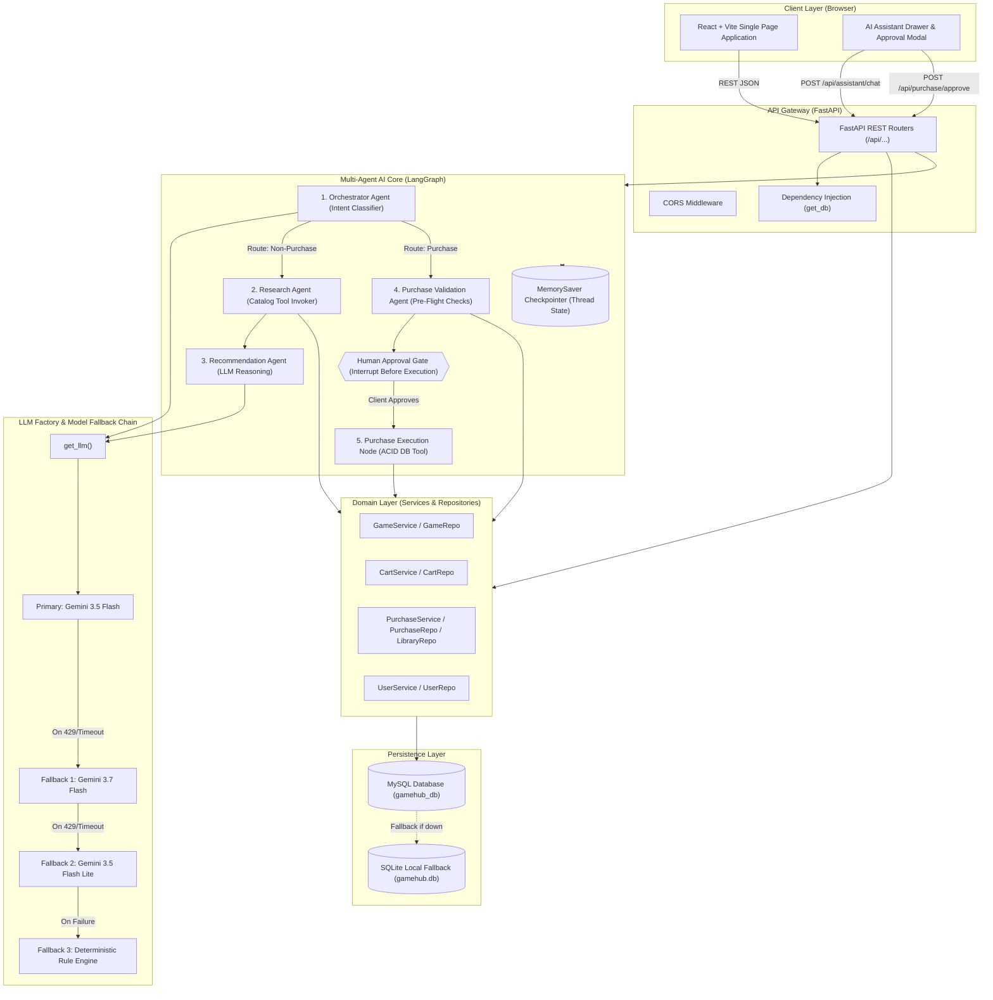
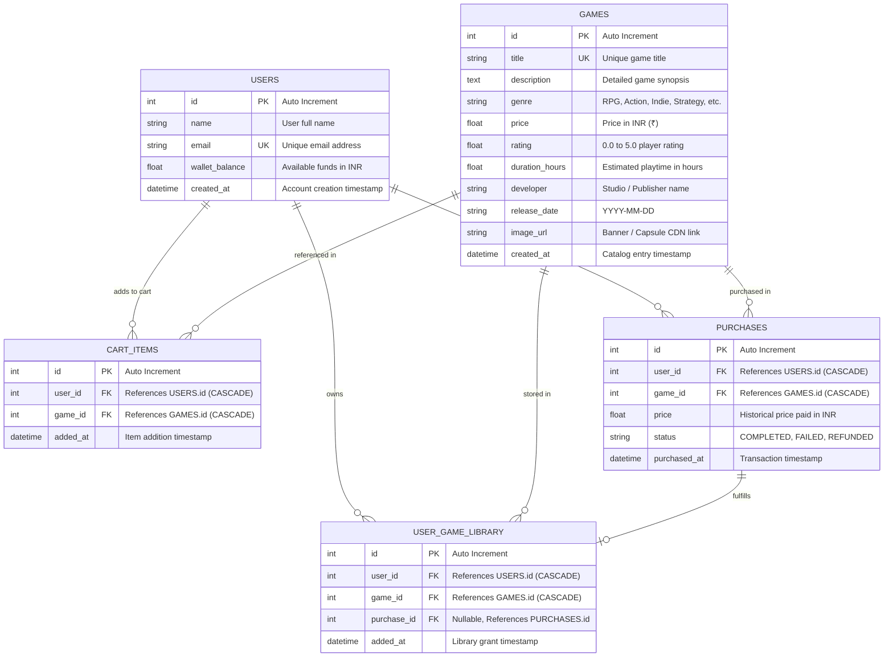
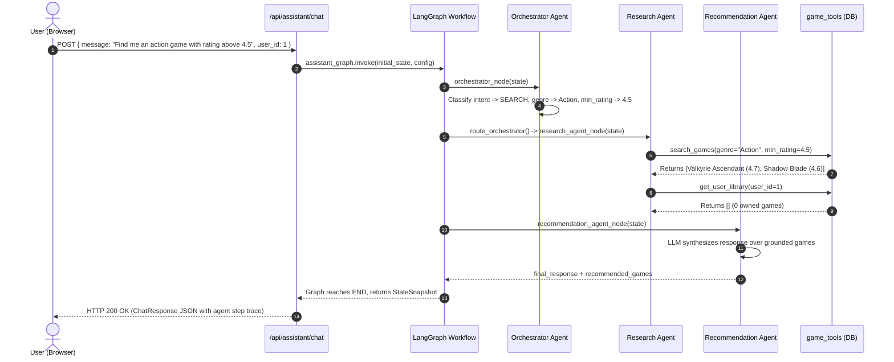
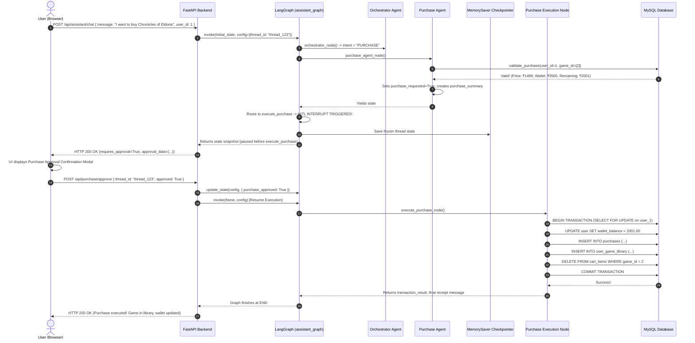

# GameHub Backend Architecture & Comprehensive Data Flow Specification

> **Version:** 1.0.0  
> **Target Audience:** Developers, System Architects, AI Engineers, and Code Reviewers  
> **Codebase:** `Steam_multi_agent / backend`  
> **Core Frameworks:** FastAPI, LangGraph, LangChain, SQLAlchemy (MySQL / SQLite Fallback), Pydantic v2  

---

## Table of Contents

1. [System Overview & Architectural Philosophy](#1-system-overview--architectural-philosophy)
2. [Complete Directory & File Taxonomy](#2-complete-directory--file-taxonomy)
3. [Database & Persistence Layer](#3-database--persistence-layer)
   - [3.1 Entity Relationship Diagram (ERD)](#31-entity-relationship-diagram-erd)
   - [3.2 Data Models Specification](#32-data-models-specification)
   - [3.3 Connection Pooling & Auto-Creation](#33-connection-pooling--auto-creation)
   - [3.4 Seeding & Startup Session Refresh](#34-seeding--startup-session-refresh)
4. [Layered Domain Architecture](#4-layered-domain-architecture)
   - [4.1 Repository Layer](#41-repository-layer)
   - [4.2 Service Layer](#42-service-layer)
   - [4.3 Tool Layer (Agent Grounding Bridge)](#43-tool-layer-agent-grounding-bridge)
5. [Multi-Agent System & LangGraph Orchestration](#5-multi-agent-system--langgraph-orchestration)
   - [5.1 StateGraph Topology & Execution Pipeline](#51-stategraph-topology--execution-pipeline)
   - [5.2 State Schema (`GameAssistantState`)](#52-state-schema-gameassistantstate)
   - [5.3 Checkpointing & Session Memory (`MemorySaver`)](#53-checkpointing--session-memory-memorysaver)
   - [5.4 Agent 1: Lead Orchestrator Agent](#54-agent-1-lead-orchestrator-agent)
   - [5.5 Agent 2: Catalog Research Agent](#55-agent-2-catalog-research-agent)
   - [5.6 Agent 3: Recommendation & Comparison Agent](#56-agent-3-recommendation--comparison-agent)
   - [5.7 Agent 4: Purchase Pre-Validation Agent](#57-agent-4-purchase-pre-validation-agent)
   - [5.8 Node 5: Atomic Purchase Execution Node](#58-node-5-atomic-purchase-execution-node)
6. [LLM Factory & Resilient Multi-Model Fallback Chain](#6-llm-factory--resilient-multi-model-fallback-chain)
   - [6.1 Fallback Chaining Architecture](#61-fallback-chaining-architecture)
   - [6.2 Structured Outputs & Output Sanitization](#62-structured-outputs--output-sanitization)
7. [End-to-End Data Flow Lifecycles (Step-by-Step Traces)](#7-end-to-end-data-flow-lifecycles-step-by-step-traces)
   - [7.1 Flow A: Natural Language Game Search](#71-flow-a-natural-language-game-search)
   - [7.2 Flow B: Multi-Constraint Budget/Playtime Recommendation](#72-flow-b-multi-constraint-budgetplaytime-recommendation)
   - [7.3 Flow C: Game Comparison Analysis](#73-flow-c-game-comparison-analysis)
   - [7.4 Flow D: Cart Inspection & Advisory](#74-flow-d-cart-inspection--advisory)
   - [7.5 Flow E: Human-in-the-Loop (HITL) Purchase Workflow](#75-flow-e-human-in-the-loop-hitl-purchase-workflow)
   - [7.6 Flow F: Wallet Topup & Store State Refresh](#76-flow-f-wallet-topup--store-state-refresh)
8. [API Gateway & Routing Layer](#8-api-gateway--routing-layer)
   - [8.1 REST Endpoints Contract](#81-rest-endpoints-contract)
   - [8.2 Pydantic Validation Schemas](#82-pydantic-validation-schemas)
9. [Transactional Integrity & Error Recovery Matrix](#9-transactional-integrity--error-recovery-matrix)
10. [Testing & Verification Architecture](#10-testing--verification-architecture)

---

## 1. System Overview & Architectural Philosophy

**GameHub** is a next-generation, agentic e-commerce platform designed for digital video game distribution. Unlike traditional static web stores where interactions are restricted to rigid faceted search boxes, GameHub embeds an autonomous **multi-agent artificial intelligence core** capable of multi-variable constraint solving, comparative reasoning, playtime evaluation, and transactional execution with strict **Human-in-the-Loop (HITL)** safeguards.



### Core Design Principles:
1. **Zero Hallucination Guarantee:** AI agents never invent game titles, pricing, or system availability. All recommendations and transactions are strictly grounded by invoking controlled database tools.
2. **ACID Transactional Safety:** Purchases, wallet deductions, library ownership insertions, and cart removals occur inside atomic database transactions with pessimistic row-locking (`with_for_update()`).
3. **Human-in-the-Loop (HITL) Interruption:** Purchases are **never** executed autonomously. LangGraph forcibly pauses execution at an interrupt gate, yields control back to the human client with a price summary, and only executes upon signed human approval.
4. **Resilient Multi-Model Fallback:** Rate limits (HTTP 429) or upstream model outages automatically and invisibly fall back through a priority list of models (`gemini-3.5-flash` → `gemini-3.7-flash` → `gemini-3.5-flash-lite` → Deterministic Rule Engine).
5. **Fresh Session Auto-Reset:** Every time the backend application is launched or restarted, user library ownership, carts, and past transactions are automatically refreshed so the demo starts cleanly with 0 games in the library and ₹3,500.00 wallet funds.

---

## 2. Complete Directory & File Taxonomy

```
backend/
├── app/
│   ├── agents/
│   │   ├── orchestrator.py           # Lead Orchestrator: Classifies user intent and extracts constraints (budget, genre, duration)
│   │   ├── purchase_agent.py         # Purchase Agent: Validates game ID, ownership, wallet balance, and creates approval summary
│   │   ├── recommendation_agent.py   # Recommendation Agent: Synthesizes candidate games and formats markdown comparisons
│   │   └── research_agent.py         # Research Agent: Invokes DB tools to fetch factual game, wallet, and cart data
│   │
│   ├── api/
│   │   ├── assistant.py              # REST API: /api/assistant/chat, /api/purchase/approve, /api/purchase/reject
│   │   ├── cart.py                   # REST API: /api/users/{user_id}/cart (GET, POST, DELETE)
│   │   ├── games.py                  # REST API: /api/games (Catalog search, filters, genres, game details)
│   │   ├── library.py                # REST API: /api/users/{user_id}/library (Owned games retrieval)
│   │   └── users.py                  # REST API: /api/users/{user_id} (Profile, wallet top-up, session reset)
│   │
│   ├── database/
│   │   ├── base.py                   # SQLAlchemy declarative Base registry
│   │   ├── sample_data.py / seed_data.py # 18 curated AAA/Indie games dataset & reset_and_seed_database() engine
│   │   └── session.py                # Engine initialization, pool configuration, MySQL/SQLite failover, get_db()
│   │
│   ├── graph/
│   │   ├── nodes.py                  # LangGraph operational nodes (e.g. execute_purchase_node)
│   │   ├── state.py                  # TypedDict GameAssistantState definition
│   │   └── workflow.py               # StateGraph compilation, conditional edges, MemorySaver checkpointer, HITL interrupts
│   │
│   ├── models/
│   │   ├── __init__.py               # Central export of all ORM models for SQLAlchemy discovery
│   │   ├── cart.py                   # CartItem ORM table mapping
│   │   ├── game.py                   # Game catalog ORM table mapping
│   │   ├── library.py                # UserGameLibrary ownership ORM table mapping
│   │   ├── purchase.py               # Purchase audit log ORM table mapping
│   │   └── user.py                   # User account and wallet balance ORM table mapping
│   │
│   ├── prompts/
│   │   ├── orchestrator_prompt.py    # System prompt for LLM intent classification
│   │   ├── purchase_prompt.py        # System prompt for purchase reasoning
│   │   ├── recommendation_prompt.py  # System prompt for personalized game advice
│   │   └── research_prompt.py        # System prompt for catalog retrieval
│   │
│   ├── repositories/
│   │   ├── __init__.py               # Repositories central export
│   │   ├── cart_repo.py              # Cart database queries (add, remove, clear, list)
│   │   ├── game_repo.py              # Game catalog queries with multi-faceted filtering
│   │   ├── library_repo.py           # Ownership checking and library insertion
│   │   ├── purchase_repo.py          # Purchase transaction history logging
│   │   └── user_repo.py              # User retrieval and wallet balance updates
│   │
│   ├── schemas/
│   │   ├── assistant.py              # Pydantic models: ChatRequest, ChatResponse, AgentStepLog
│   │   ├── cart.py                   # Pydantic models: CartItemRead, CartSummary, CartAddRequest
│   │   ├── game.py                   # Pydantic models: GameRead, GameFilterParams
│   │   ├── purchase.py               # Pydantic models: PurchaseSummary, PurchaseExecutionResult, PurchaseRead
│   │   └── user.py                   # Pydantic models: UserRead, WalletTopupRequest
│   │
│   ├── services/
│   │   ├── cart_service.py           # Business logic: Cart calculation, item validation, wallet affordability
│   │   ├── game_service.py           # Business logic: Faceted catalog search, genre taxonomy, sorting
│   │   ├── llm_factory.py            # LangChain model factory with automatic multi-model fallback chain & stringifier
│   │   └── purchase_service.py       # Atomic purchase transaction with ACID locking, rollback, and validation
│   │
│   ├── tools/
│   │   └── game_tools.py             # Controlled deterministic tools used by LangGraph agents to access DB safely
│   │
│   ├── config.py                     # Pydantic BaseSettings environment variables loader (.env)
│   └── main.py                       # FastAPI entrypoint, CORS setup, startup database lifecycle hooks, router mounts
│
├── tests/
│   ├── test_db_and_services.py       # Pytest suite for database CRUD, cart operations, atomic purchases, rollbacks
│   └── test_langgraph_workflow.py    # Pytest suite for LangGraph multi-agent orchestration & HITL approval/resume
│
├── seed.py                           # Standalone CLI seeding script
├── requirements.txt                  # Python dependencies
└── .env                              # Environment configuration (DB credentials, Gemini API key, active models)
```

---

## 3. Database & Persistence Layer

The persistence layer uses **SQLAlchemy ORM** targeting a **MySQL 8.0+** instance (`gamehub_db`), with seamless auto-fallback to a local **SQLite** database (`gamehub.db`) if MySQL is unavailable.

### 3.1 Entity Relationship Diagram (ERD)



### 3.2 Data Models Specification

1. **`User` (`app.models.user`)**:
   - `id`: Primary key.
   - `wallet_balance`: Float (default `3500.00`). Represents user's store currency.
   - Relationships: One-to-many with `CartItem`, `Purchase`, and `UserGameLibrary`.
2. **`Game` (`app.models.game`)**:
   - Stores game metadata including `price`, `rating`, `duration_hours`, `genre`, and `image_url`.
   - Has unique constraint on `title`.
3. **`CartItem` (`app.models.cart`)**:
   - Junction table holding games staged for checkout by a user.
   - Composite uniqueness on `(user_id, game_id)`.
4. **`Purchase` (`app.models.purchase`)**:
   - Immutable financial audit record capturing point-in-time transaction details (`price`, `status="COMPLETED"`).
5. **`UserGameLibrary` (`app.models.library`)**:
   - Digital rights ownership registry.
   - Composite uniqueness on `(user_id, game_id)` ensures a user cannot purchase or own duplicate copies.

### 3.3 Connection Pooling & Auto-Creation

In [`app.database.session`](file:///c:/MyFolder/Steam_multi_agent/backend/app/database/session.py):
- Before connecting to MySQL, `ensure_database_exists()` connects to the root server and executes `CREATE DATABASE IF NOT EXISTS gamehub_db CHARACTER SET utf8mb4`.
- The SQLAlchemy engine is initialized with connection pooling (`pool_size=10`, `max_overflow=20`, `pool_recycle=3600`, `pool_pre_ping=True`).
- If MySQL is down, it logs a warning and falls back to `sqlite:///./gamehub.db`.

### 3.4 Seeding & Startup Session Refresh

In [`app.database.seed_data`](file:///c:/MyFolder/Steam_multi_agent/backend/app/database/seed_data.py):
- Contains 18 curated game titles covering diverse genres (Cyberpunk RPG, Space 4X Strategy, Victorian Psychological Horror, Metroidvania Indie, etc.).
- **`reset_and_seed_database(db, reset_user_data=True)`**:
  1. Verifies/populates all 18 games in the `Game` table.
  2. Ensures default demo user **Alex Mercer** (`id=1`) exists with `wallet_balance = 3500.00`.
  3. Purges all rows from `user_game_library`, `cart_items`, and `purchases` for user 1.
  4. Executed automatically on every FastAPI startup (`@app.on_event("startup")` in [main.py](file:///c:/MyFolder/Steam_multi_agent/backend/app/main.py#L30-L40)) and callable on-demand via `POST /api/users/1/reset`.

---

## 4. Layered Domain Architecture

GameHub strictly decouples database access from business logic and agent reasoning using the **Repository-Service Pattern**.

```
[FastAPI Routers / LangGraph Tools]
               │
               ▼
      [Domain Services]  (e.g., PurchaseService, CartService, GameService)
               │
               ▼
    [Repository Layer]   (e.g., GameRepository, LibraryRepository, UserRepo)
               │
               ▼
     [SQLAlchemy Models] ──▶ [MySQL / SQLite Database]
```

### 4.1 Repository Layer (`app.repositories`)
Encapsulates all raw SQLAlchemy queries:
- **`GameRepository`**: Implements dynamic SQL filtering across `genre`, `max_price`, `max_duration`, `min_rating`, and full-text `search`, plus multi-column ordering (`price_asc`, `price_desc`, `rating_desc`, `playtime_desc`).
- **`CartRepository`**: Queries active cart items with joined game relationships.
- **`LibraryRepository`**: Checks ownership with `is_game_owned(user_id, game_id)` and returns owned game ID sets.
- **`UserRepository`**: Fetches user entities and updates wallet balances.
- **`PurchaseRepository`**: Logs purchase audit records.

### 4.2 Service Layer (`app.services`)
Encapsulates business rules and transactional integrity:
- **`GameService`**: Translates user filter parameters into repository queries and enriches results with `is_owned` and `is_in_cart` flags.
- **`CartService`**: Calculates cart totals, validates items, checks if wallet balance covers cart sum (`is_affordable`), and throws `ValueError` if a user attempts to add an already-owned game.
- **`PurchaseService`**:
  - **`validate_purchase(user_id, game_ids)`**: Pre-transaction dry run. Verifies game existence, checks for duplicate ownership, computes total sum, checks wallet balance sufficiency, and returns `PurchaseSummary`.
  - **`execute_purchase(user_id, game_ids)`**: Atomic transaction execution:
    1. Validates preconditions.
    2. Locks user row using `.with_for_update()`.
    3. Deducts `user.wallet_balance`.
    4. Inserts `Purchase` records.
    5. Inserts `UserGameLibrary` records.
    6. Deletes items from `CartItem`.
    7. Atomically commits or issues `db.rollback()` on any failure.

### 4.3 Tool Layer (`app.tools.game_tools`)
Provides lightweight, deterministic, session-managed wrapper functions designed for LangGraph agent nodes:
- `search_games(genre, max_price, max_duration, min_rating, search, limit)`
- `get_game(game_id)`
- `get_user_wallet(user_id)`
- `get_user_cart(user_id)`
- `get_user_library(user_id)`
- `validate_purchase(user_id, game_ids)`
- `purchase_game(user_id, game_ids)`

---

## 5. Multi-Agent System & LangGraph Orchestration

The core intelligent assistant is implemented as a compiled **LangGraph `StateGraph`** with specialized autonomous nodes, explicit edge conditions, and state checkpointing.

```mermaid
stateDiagram-v2
    [*] --> Orchestrator : User Prompt Received

    state Orchestrator {
        direction TB
        ClassifyIntent : Classify Intent & Extract Constraints
        IntentType : Intent in [SEARCH, RECOMMEND, COMPARE, CART_QUERY, CART_MODIFICATION, GENERAL_GAME_QUERY, PURCHASE]
        ClassifyIntent --> IntentType
    }

    Orchestrator --> ResearchAgent : Non-Purchase Intent
    Orchestrator --> PurchaseAgent : Intent == PURCHASE

    state ResearchAgent {
        FetchLibrary : Retrieve User Owned Games & Wallet
        ExecuteSearch : Query Catalog with Constraints
        FetchLibrary --> ExecuteSearch
    }

    ResearchAgent --> RecommendationAgent

    state RecommendationAgent {
        Reason : LLM Reasons Over Grounded Candidates
        Synthesize : Format Markdown Table / Recs / Comparison
        Reason --> Synthesize
    }

    RecommendationAgent --> [*] : Return Final Response

    state PurchaseAgent {
        ResolveGame : Identify Target Game ID(s)
        ValidateDB : Run validate_purchase()
        PrepareSummary : Generate PurchaseSummary
        ResolveGame --> ValidateDB --> PrepareSummary
    }

    PurchaseAgent --> ApprovalGate : Valid Purchase Request
    PurchaseAgent --> [*] : Validation Failed (e.g. Already Owned / Empty Cart)

    state ApprovalGate {
        Interrupt : Pause Execution (interrupt_before)
        YieldToUser : Return Summary to Client for Human Review
        Interrupt --> YieldToUser
    }

    ApprovalGate --> ExecutionNode : Client Approves (purchase_approved = True)
    ApprovalGate --> Cancelled : Client Rejects (purchase_approved = False)

    state ExecutionNode {
        LockDB : Acquire Row Lock (with_for_update)
        DeductWallet : Deduct Funds & Insert Ownership
        CommitACID : Atomic Commit to MySQL
        LockDB --> DeductWallet --> CommitACID
    }

    ExecutionNode --> [*] : Return Transaction Receipt
    Cancelled --> [*] : Return Cancellation Notice
```

### 5.1 StateGraph Topology & Execution Pipeline

In [`app.graph.workflow`](file:///c:/MyFolder/Steam_multi_agent/backend/app/graph/workflow.py):
1. **Nodes Added**:
   - `orchestrator`: Intent classification and constraint extraction.
   - `research`: Deterministic tool execution against catalog, wallet, cart, and library.
   - `recommendation`: LLM-based reasoning, comparison synthesis, and playtime analysis.
   - `purchase_validation`: Pre-flight purchase validation and summary construction.
   - `execute_purchase`: ACID database transaction execution.
2. **Edge Rules**:
   - `START -> orchestrator`
   - `orchestrator -> conditional edge`:
     - If `intent == "PURCHASE"` → routes to `purchase_validation`.
     - Otherwise → routes to `research`.
   - `research -> recommendation -> END`
   - `purchase_validation -> conditional edge`:
     - If `purchase_requested == True` → routes to `execute_purchase`.
     - Otherwise → routes to `END`.
   - `execute_purchase -> END`
3. **Interrupt Definition**:
   - `interrupt_before=["execute_purchase"]`: LangGraph pauses graph execution immediately before invoking `execute_purchase`. The state is frozen in the checkpointer, allowing human approval over HTTP.

### 5.2 State Schema (`GameAssistantState`)

Defined in [`app.graph.state`](file:///c:/MyFolder/Steam_multi_agent/backend/app/graph/state.py):
```python
class GameAssistantState(TypedDict):
    user_id: int
    message: str
    current_game_id: Optional[int]
    thread_id: str
    
    # Orchestration & Constraints
    intent: Optional[str]                     # SEARCH, RECOMMEND, COMPARE, CART_QUERY, CART_MODIFICATION, PURCHASE, GENERAL_GAME_QUERY
    requirements: Optional[Dict[str, Any]]   # genre, max_price, max_duration, min_rating, search_query, game_titles, cart_action
    
    # Grounded Research Context
    candidate_games: Optional[List[Dict[str, Any]]]
    user_library: Optional[List[Dict[str, Any]]]
    wallet_info: Optional[Dict[str, Any]]
    cart_items: Optional[List[Dict[str, Any]]]
    
    # Recommendation Outputs
    recommendations: Optional[List[Dict[str, Any]]]
    
    # Purchase & HITL Flow
    purchase_requested: Optional[bool]
    purchase_approved: Optional[bool]
    purchase_summary: Optional[Dict[str, Any]]
    transaction_result: Optional[Dict[str, Any]]
    
    # Response & Audit Trace
    final_response: Optional[str]
    agent_steps: Optional[List[Dict[str, Any]]]
```

### 5.3 Checkpointing & Session Memory (`MemorySaver`)
- Initialized with `checkpointer = MemorySaver()`.
- Every invocation is keyed by a unique `thread_id` (e.g. `user_1_a8f9c2d1`).
- When an interruption occurs at the purchase approval gate, the thread state is retained in memory. When the user submits `/api/purchase/approve`, `assistant_graph.update_state(config, {"purchase_approved": True})` resumes execution from the exact point of interruption.

### 5.4 Agent 1: Lead Orchestrator Agent (`app.agents.orchestrator`)
- **Role:** Understands free-form user language, classifies intent, and extracts structured constraints.
- **LLM Structured Extraction:** Uses `llm.with_structured_output(OrchestratorDecision)` with JSON schema validation.
- **Deterministic Regex Fallback:** If the LLM is unavailable or fails, `fallback_intent_classifier` extracts currency figures (`₹1500`, `under 2000`), durations (`under 30 hrs`), genres, and keywords (`buy`, `cart`, `compare`).

### 5.5 Agent 2: Catalog Research Agent (`app.agents.research_agent`)
- **Role:** Factual data retriever.
- **Execution:** Invokes `get_user_library()`, `get_user_wallet()`, `get_user_cart()`, and `search_games()` to fetch up to 12 matching candidate games from the database.
- Marks each candidate with `is_owned = True/False` so downstream agents never recommend already-owned titles.

### 5.6 Agent 3: Recommendation & Comparison Agent (`app.agents.recommendation_agent`)
- **Role:** Synthesis and reasoning engine.
- **Prompt:** Grounded with user balance, owned games, cart items, and the candidate games retrieved by the Research Agent.
- **Output:** Produces rich GitHub-flavored markdown responses with comparison tables, playtime-to-price value ratios, and tailored advice without hallucinating unlisted titles.
- **Rule-Based Fallback:** Includes deterministic templates for game comparisons, cart breakdowns, and recommendations if LLM calls fail.

### 5.7 Agent 4: Purchase Pre-Validation Agent (`app.agents.purchase_agent`)
- **Role:** Pre-flight transactional gatekeeper.
- **Resolution Cases:**
  1. Cart purchase: Resolves all item IDs from `get_user_cart()`.
  2. Contextual game: Resolves `current_game_id` if user viewed a game and said "buy this".
  3. Explicit title mention: Strips action verbs ("buy", "order") and performs exact/partial catalog search.
- **Validation:** Calls `validate_purchase(user_id, game_ids)`. If game is already owned or funds are insufficient, returns an explanatory notice and stops.
- If valid, sets `purchase_requested = True`, creates `purchase_summary`, and yields control to the HITL gate.

### 5.8 Node 5: Atomic Purchase Execution Node (`app.graph.nodes`)
- **Role:** Executes the database transaction.
- **Security Check:** Asserts `state["purchase_approved"] == True`. If approval is missing or false, aborts immediately.
- **Execution:** Calls `purchase_game(user_id, game_ids)`, fetches updated wallet balance, logs step trace, and outputs final success receipt.

---

## 6. LLM Factory & Resilient Multi-Model Fallback Chain

Implemented in [`app.services.llm_factory`](file:///c:/MyFolder/Steam_multi_agent/backend/app/services/llm_factory.py):

### 6.1 Fallback Chaining Architecture

```mermaid
flowchart TD
    Req[Agent Requests LLM Instance] --> Factory[get_llm]
    Factory --> ConfigCheck{Provider == 'openai' or 'gemini'?}

    ConfigCheck -- OpenAI --> OpenAIInit[ChatOpenAI Model]
    ConfigCheck -- Gemini --> ParseModels[Parse GEMINI_MODELS List from .env]

    ParseModels --> InitPrimary[Primary: ChatGoogleGenerativeAI - gemini-3.5-flash]
    ParseModels --> InitFB1[Fallback 1: ChatGoogleGenerativeAI - gemini-3.7-flash]
    ParseModels --> InitFB2[Fallback 2: ChatGoogleGenerativeAI - gemini-3.5-flash-lite]

    InitPrimary & InitFB1 & InitFB2 --> Chain[primary_llm.with_fallbacks([FB1, FB2])]
    Chain --> ReturnLLM[Return Resilient Runnable]

    ReturnLLM --> AgentInvoke[Agent Invokes Model]
    AgentInvoke -->|Success| Out[Raw Output]
    AgentInvoke -->|429 Rate Limit / Error on Primary| AutoFB1[LangChain Auto-Switches to gemini-3.7-flash]
    AutoFB1 -->|Success| Out
    AutoFB1 -->|429 / Error on FB1| AutoFB2[LangChain Auto-Switches to gemini-3.5-flash-lite]
    AutoFB2 -->|Success| Out
    AutoFB2 -->|All Models Fail| Deterministic[Agent Rule-Based Fallback Engine]
```

### 6.2 Structured Outputs & Output Sanitization

In newer versions of `langchain-google-genai` and Gemini 3.5/3.7, responses can return content as a list of structured text dictionaries (e.g. `[{'type': 'text', 'text': '...'}]`) rather than a simple string.

To prevent Pydantic string validation errors, [`stringify_content`](file:///c:/MyFolder/Steam_multi_agent/backend/app/services/llm_factory.py#L8-L29) recursively unpacks lists, dicts, and objects into a clean, normalized string:
```python
def stringify_content(content: Any) -> str:
    if content is None:
        return ""
    if isinstance(content, str):
        return content
    if isinstance(content, list):
        text_parts = []
        for item in content:
            if isinstance(item, str):
                text_parts.append(item)
            elif isinstance(item, dict) and "text" in item:
                text_parts.append(str(item["text"]))
            elif hasattr(item, "text"):
                text_parts.append(str(item.text))
            else:
                text_parts.append(str(item))
        return "".join(text_parts).strip()
    return str(content)
```

---

## 7. End-to-End Data Flow Lifecycles (Step-by-Step Traces)

### 7.1 Flow A: Natural Language Game Search
**User Prompt:** *"Find me an action game with rating above 4.5"*



---

### 7.2 Flow B: Multi-Constraint Budget/Playtime Recommendation
**User Prompt:** *"I have ₹2000 and want a game with at least 50 hours of playtime"*

1. **Orchestrator:** Parses `intent = "RECOMMEND"`, `max_price = 2000.0`, `max_duration = 50.0`.
2. **Research Agent:** Calls `search_games(max_price=2000.0, limit=12)`. Filters candidate games with `duration_hours >= 50.0` (e.g. *Chronicles of Eldoria* [95h, ₹1499], *Stellar Dominion* [120h, ₹1799]).
3. **Recommendation Agent:** Evaluates value-per-hour metrics and generates tailored advice highlighting quest depth and replayability.
4. **API Gateway:** Returns formatted chat message with embedded game cards.

---

### 7.3 Flow C: Game Comparison Analysis
**User Prompt:** *"Compare Chronicles of Eldoria with Cyberstrike"*

1. **Orchestrator:** Extracts `intent = "COMPARE"`, `game_titles = ["Chronicles of Eldoria", "Cyberstrike"]`.
2. **Research Agent:** Queries catalog for both titles, retrieving genre, price, rating, developer, and playtime.
3. **Recommendation Agent:** Formulates a side-by-side Markdown comparison matrix comparing RPG world-building vs. Cyberpunk action combat.
4. **Client:** Renders table in the AI Assistant Drawer.

---

### 7.4 Flow D: Cart Inspection & Advisory
**User Prompt:** *"What is in my cart, and can I afford it?"*

1. **Orchestrator:** Classifies `intent = "CART_QUERY"`.
2. **Research Agent:** Calls `get_user_cart(1)` and `get_user_wallet(1)`.
3. **Recommendation Agent:** Calculates cart total, checks wallet balance, and advises the user whether they have sufficient funds or need to top up.

---

### 7.5 Flow E: Human-in-the-Loop (HITL) Purchase Workflow
**User Prompt:** *"I want to buy Chronicles of Eldoria"*



---

### 7.6 Flow F: Wallet Topup & Store State Refresh
1. **Wallet Topup (`POST /api/users/{user_id}/wallet/topup`)**:
   - Accepts `{ "amount": 1000.0 }`.
   - Validates positive float.
   - Atomically updates and commits `user.wallet_balance`.
   - Returns updated user profile.
2. **Store State Refresh (`POST /api/users/{user_id}/reset`)**:
   - Calls `reset_and_seed_database(db, reset_user_data=True)`.
   - Resets wallet to ₹3,500.00.
   - Empties library, cart, and purchase audit tables.
   - Re-syncs 18 catalog games.

---

## 8. API Gateway & Routing Layer

### 8.1 REST Endpoints Contract

| Method | Endpoint | Description | Request Body | Response Schema |
| :--- | :--- | :--- | :--- | :--- |
| `GET` | `/api/games` | Search & filter game catalog | Query params (`genre`, `max_price`, `max_duration`, `min_rating`, `search`, `sort_by`, `user_id`) | `List[GameRead]` |
| `GET` | `/api/games/genres` | Get unique catalog genres | None | `List[str]` |
| `GET` | `/api/games/{game_id}` | Get detailed game info | Query param (`user_id`) | `GameRead` |
| `GET` | `/api/users/{user_id}` | Get user profile & wallet | None | `UserRead` |
| `POST` | `/api/users/{user_id}/wallet/topup` | Top up wallet funds | `WalletTopupRequest` | `UserRead` |
| `POST` | `/api/users/{user_id}/reset` | Reset library & wallet to default | None | `UserRead` |
| `GET` | `/api/users/{user_id}/cart` | Get shopping cart summary | None | `CartSummary` |
| `POST` | `/api/users/{user_id}/cart` | Add game to cart | `CartAddRequest` | `CartSummary` |
| `DELETE`| `/api/users/{user_id}/cart/{game_id}` | Remove game from cart | None | `CartSummary` |
| `DELETE`| `/api/users/{user_id}/cart` | Clear entire cart | None | `CartSummary` |
| `GET` | `/api/users/{user_id}/library` | Get owned games | None | `List[GameRead]` |
| `POST` | `/api/assistant/chat` | AI Assistant LangGraph query | `ChatRequest` | `ChatResponse` |
| `POST` | `/api/purchase/approve` | Human approval for purchase | `PurchaseApprovalRequest` | `ChatResponse` |
| `POST` | `/api/purchase/reject` | Human rejection for purchase | `PurchaseApprovalRequest` | `ChatResponse` |

### 8.2 Pydantic Validation Schemas

- **`ChatRequest`**:
  - `user_id`: `int` (default `1`)
  - `message`: `str` (required)
  - `current_game_id`: `Optional[int]`
  - `thread_id`: `Optional[str]`
- **`ChatResponse`**:
  - `thread_id`: `str`
  - `intent`: `Optional[str]`
  - `response`: `str` (enforced as clean string via `stringify_content`)
  - `requires_approval`: `bool`
  - `approval_data`: `Optional[PurchaseSummary]`
  - `agent_steps`: `List[AgentStepLog]`
  - `recommended_games`: `List[Dict[str, Any]]`
  - `cart_items`: `List[Dict[str, Any]]`
  - `transaction_result`: `Optional[Dict[str, Any]]`

---

## 9. Transactional Integrity & Error Recovery Matrix

| Scenario / Edge Case | System Component | Detection Mechanism | Resolution / Mitigation Strategy |
| :--- | :--- | :--- | :--- |
| **Gemini Model 429 Quota Limit** | `llm_factory.py` | LangChain `ChatGoogleGenerativeAI` throws `RESOURCE_EXHAUSTED` | Automatically falls back to `gemini-3.7-flash` -> `gemini-3.5-flash-lite` via `.with_fallbacks()`. If all fail, falls back to deterministic rule engine. |
| **Pydantic Content List Format** | `llm_factory.py` | LLM returns `[{'type':'text','text':'...'}]` | `stringify_content()` normalizes content blocks into flat string before Pydantic validation. |
| **User Already Owns Game** | `PurchaseService` / `PurchaseAgent` | `LibraryRepository.is_game_owned(user_id, game_id) == True` | `GameAlreadyOwnedError` raised. User notified immediately; purchase workflow halted. |
| **Insufficient Wallet Funds** | `PurchaseService` | `user.wallet_balance < total_price` | `InsufficientWalletError` raised with exact shortfall amount. Prompt advises wallet top-up. |
| **Concurrent Wallet Race Condition** | `PurchaseService` | Database transaction with `SELECT FOR UPDATE` | User row is locked in MySQL until commit/rollback, preventing double-spend. |
| **MySQL Server Disconnected** | `database.session` | Connection attempt failure | Automatically logs warning and switches to local `sqlite:///./gamehub.db`. |
| **Unapproved Purchase Attempt** | `nodes.py` (`execute_purchase_node`) | `state.get("purchase_approved") != True` | Node refuses execution, logs security step, and outputs cancellation response. |

---

## 10. Testing & Verification Architecture

The backend includes a comprehensive **Pytest** test suite:

### 1. `tests/test_db_and_services.py`
- `test_game_search_and_retrieval`: Validates faceted search, genre filtering, and budget thresholds.
- `test_cart_operations`: Tests adding, removing, clearing cart items, and summary calculations.
- `test_duplicate_ownership_prevention`: Ensures adding or purchasing an owned game raises validation errors.
- `test_insufficient_wallet_rollback`: Asserts database rollback occurs when wallet funds are insufficient.
- `test_atomic_purchase_transaction_success`: Verifies complete ACID lifecycle (wallet deduction, library grant, cart purge).

### 2. `tests/test_langgraph_workflow.py`
- `test_langgraph_recommendation_workflow`: Tests full graph execution from user message through Orchestrator, Research, and Recommendation nodes.
- `test_langgraph_hitl_purchase_interrupt_and_resume`: Tests purchase flow:
  1. Verifies graph interrupts before `execute_purchase`.
  2. Asserts thread state contains `purchase_summary`.
  3. Resumes with `purchase_approved = True` and verifies atomic purchase execution.

---

### Executing the Backend & Test Suite

```powershell
# Activate virtual environment
cd backend
.\venv\Scripts\activate

# Run full test suite
pytest

# Run FastAPI development server
uvicorn app.main:app --port 8000 --reload
```
